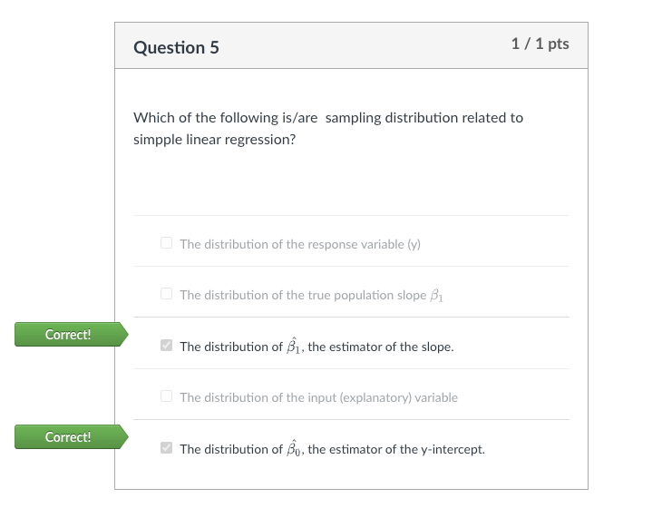
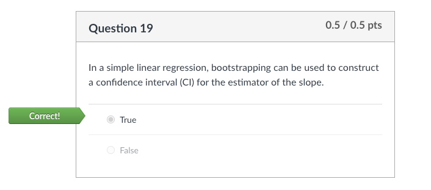

# Midterm 

- question 1

   

   

  1. False - $R^2$ always increases as you add more predictors, cannot be used to compare models of different sizes
  2. False - RSS is a measure of the model's unexplained variance, and while a lower RSS indicates a better fit, it doesn’t consider the complexity of the model
     - also, we didn't really do this in class 
  3. False - `glance` is telling us if the `model_full` is significant or not (is our `model_full` better than the null, or is all the additional predictors irrelevant)
     - however, this does not tell us how it compares to the smaller model
  4. False - again, checking the `p-value` does tell us if the newly added predictors in `model_full` is significant or not, but not how it compares to the smaller model 
  5. True - this is what we've been doing in class, the $F$​-test doesn't just tell us if the newly predictors are significant or not, but rather "Do the additional variables improve the explanatory power of the model significantly, beyond what could be expected by chance?"
     - it’s possible for individual coefficients to be statistically significant, yet the overall improvement in model fit might not justify the added complexity (e.g., due to overfitting)
     - so F-test is taking all of this into account for us, and there is a direct comparison being made between `model_full` and the smaller model

- question 2

   

  - this was just a fun fact from the notes

- question 3

   

  1. False - this is talking about the Normality of the data
  2. False - VIF being small is good 
  3. True - VIF being large is indication that there's multicollinearity
  4. False - this is talking about constant of variance 

- question 4

   

  - not much to say, we're trying to predict gas emission so that would be the response variable 
  - we're using engine size to predict gas emission so engine size is an explanatory variable

- question 5

   

  - when we're talking about sampling distributions, we're talking about the estimators themselves i.e $\hat \beta_i$ 
  - distribution of $y$​ is simply the range of values that the response variable can take
  - $\beta_1$ is the true population slope which is unknown but assumes to be constant
    - another way to think about is that it does not have a sampling distribution because it is not a statistic that varies from sample to sample

- question 6

   

  - we see a funnel shape here, which mean that it violates the assumption of equal variance

- question 7

   

   

  - from class, we know that when we do early stopping, we need to do some kind of correction to prevent the inflation of type I error
  - here, the only option that mentions any adjustment is 2 which uses Pocock

- question 8

    

  - the math is 
    $$
    \begin{align*}
    R^2 = 1 - \dfrac{RSS}{TSS} = 1 - \dfrac{71.25}{475} = 0.85
    \end{align*}
    $$

  - note that the 60 observations and 5 explanatory variables thing is a red-herring - they're asking for $R^2$ and not adjusted $R^2$​

- question 9

   

  - important to know that `glance()` is doing an ANOVA test between the full model vs the null model 

    - null model is `lm(y ~ 1, data = dat)` 

  - so what `glance` is really doing is `anova(null_model, full_model)` which gives us

    ```R
    anova(lm(y~1,data=dat), lm(y~.,data=dat))
    ```

- question 10

    

   

  - (note: I'm pretty salty about this question as ANOVA can still be used for the first question but whatever)
  - I'm pretty sure the choice between tidy and anova here is whether or not there are multiple variables involved
    - since `region` has 3 levels, it requires 2 dummy variables, while `student` only require 1
  - for 2) `glance` will give us the statistics needed to compare against the null model (predicting using the average response)

- question 11

   

   

  1. it's basically saying that the slope is the same between non-students and students
     - so we pick C as the slope looks the same there with differing intercept
  2. this is just an SLR (so only 1 predictor and 1 line) - so we pick B
  3. model having 4 parameters mean that there is a different intercept AND different slope between student and non-student
     - the graph in D reflects this pretty well

- question 12

  >In an experiment on study habits and the relation to final exam grades, data were collected on the scores on the final examination and the estimated hours spent revising for each of the 35 students on a course.
  >
  >Some of the students reported that most of the time they spent revising was in the presence of some form of distraction, such as a TV or radio. The remaining students studied most of the time with no such distractions. It is of interest to model how the final test score, 𝑌 depends on the amount of hours spent revising (𝑋 say). A model of the form
  >$$
  >Y = \beta_0 + \beta_1 X + \beta_2 W + \beta_3 XW +\varepsilon 
  >$$
  >was fitted, where 𝜀 is a Normally distributed error and the variable 𝑊 is defined as
  >$$
  >W = \begin{cases}
  >0 &\text{if a student who revised mostly without distraction}\\
  >1 &\text{if a student who revised mostly with a distraction}
  >\end{cases}
  >$$
  >The following estimates and standard errors were obtained:
  >
  > 
  >
  >(a) [2 marks] Based on the model fitted above, for a student who revised mostly without distraction, by how much would you predict their grade to increase for each additional hour of studying? Provide approximate 95% confidence interval for your estimate.(hint: $Z_{0.975} = 1.96$)
  >
  >(b) [2 mark] Based on the model fitted above, for a student who revised mostly with a distraction, by how much would you predict their grade to increase for each additional hour of studying?
  >
  >(c) [2 mark] Say there is another categorical explanatory variable 𝐻 that indicate whether a student mostly participated online office hours or mostly participated in-person office hours. How many parameters ($\beta$s) are there in the largest linear model with interactions you can fit here considering all these explanatory variables.
  >
  >(d) [2 marks] After the preliminary analysis, the researcher decided on the following estimated model to predict the final exam score:
  >$$
  >\hat 𝑌=32.95+1.74𝑋−0.39𝑋𝑊
  >$$
  >Using this model predict the final exam grade for a student who spent 18 hours revising, mostly in the presence of a distraction.

  - a) it's asking about the slope here of students studying without distraction, which is just $\beta_1$, so we can construct a CI
    $$
    \begin{align*}
    CI &= \hat b_1 \pm q_{0.975} se(\hat b_1) \\
    &= [1.520 - 1.96 \times 0.345, 1.520 + 1.96 \times 0.345] \\
    &= [0.8438, 2.1962]
    \end{align*}
    $$

  - b) this is asking about the slope of students studying with distraction, which is $\beta_1 + \beta_3$ as there's an interaction term (different slopes)

    - so I will expect their grades to increase by $1.520 - 0.473 = 1.047$ points

  - c) this is actually kind of a hard question - requires some STAT 306 knowledge

    - one way to think of it is to think of all possible levels or "states" a student can take on

      - `(distraction, in person)`, `(distraction, online)`, `(no distraction, in person)`, `(no distraction, online)`
      - base line: has 2 terms - just $\beta_0$ and $\beta_1$
      - first level: need to add 2 terms to the base line model, so we can have a different slope and different intercept to them 
      - same for every additional level, so we have $2 + 3(2) = 8$ terms

    - full model looks like
      $$
      Y = \beta_0 + \beta_1 X + \beta_2 W +\beta_3 XW +\beta_4 H + \beta_5 XH +\beta_6 WH + \beta_7 XWH
      $$
       

    - TODO: general formula for this case?

      - I think it's $2 \times \text{number of levels}$

  - d) you just have to do the math, $ 32.95 + 1.74(18) - 0.39(18)(1) = 57.25$

- question 13

   

  - if there are $k$ levels, we need $k - 1$ dummy variables 

- question 14

   

  - confidence intervals are centered around the <u>sample statistics</u> (i.e the $\hat b_1$ we found via our sample)

- question 15

   

  - holding $x_2$ constant, the value of $y$ will increase by $2.25$
    - (just try out 2 random number of $x_1$ that's 1 apart)

- question 16

   

  - reducing the significance level is the same making the p-value larger, both serve to reject less often 

- question 17

   

  - bit of a trivia question, but Pocock is constant throughout, O'brien is not

- question 18

   

  - this is basically A/A testing
  - at some point in time, there's always a possibility (possibly due to pure random chance) that our p-value might dip below 0.05, which is why we shouldn't just reject as soon as this happens

- question 19

   

  - true, this is the alternate approach to `tidy()`