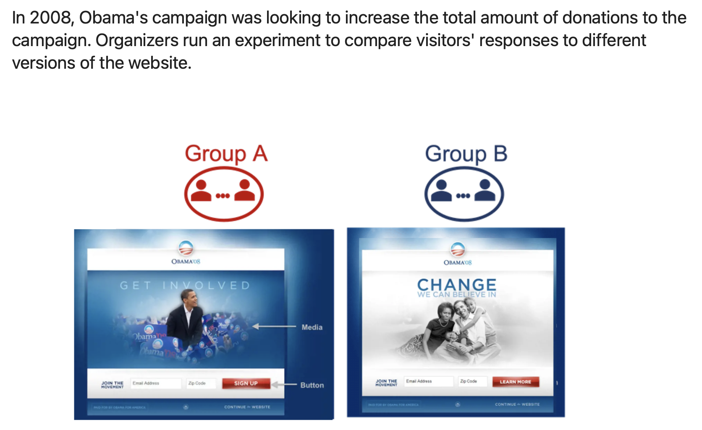
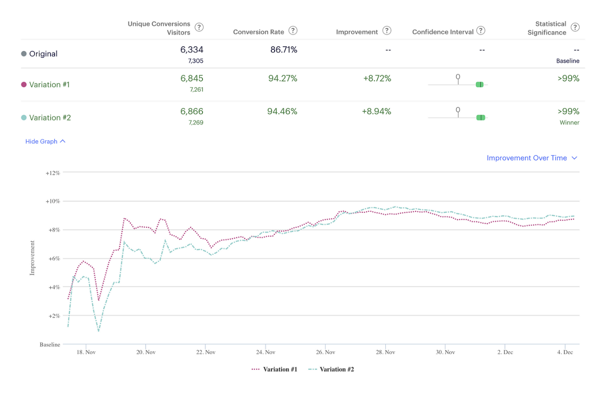
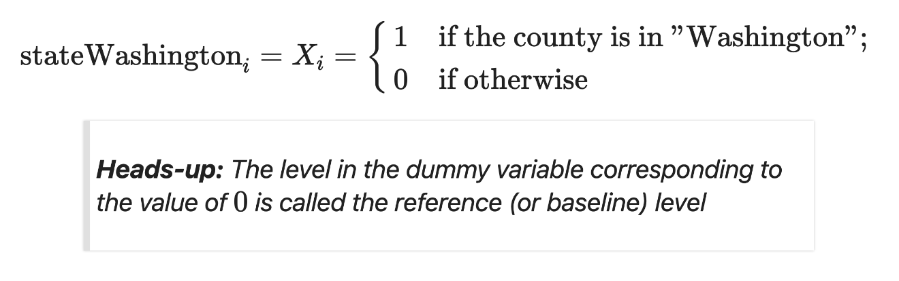
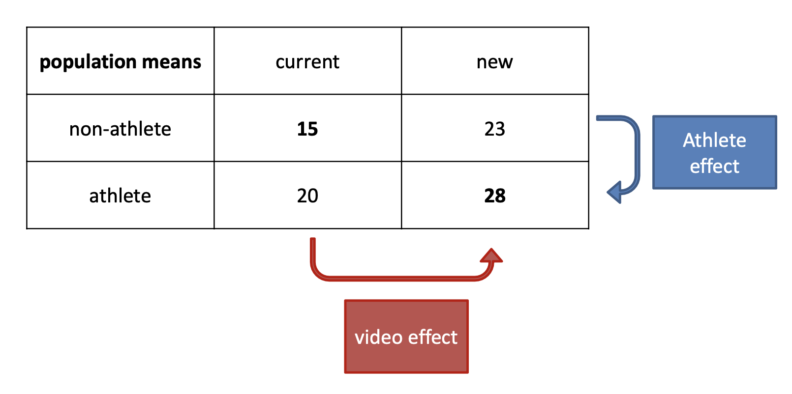
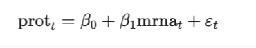

# Review

## <u>Review: Question Types</u>

| Question type | Description                                                  | Example                                                      |
| :-----------: | ------------------------------------------------------------ | ------------------------------------------------------------ |
|  Descriptive  | A question that asks about summarized characteristics of a data set without interpretation (i.e., report a fact). | How many people live in each province and territory in Canada? |
|  Exploratory  | A question that asks if there are patterns, trends, or relationships within a single data set. Often used to propose hypotheses for future study. | Does political party voting change with indicators of wealth in a set of data collected on 2,000 people living in Canada? |
|  Predictive   | A question that asks about predicting measurements or labels for individuals (people or things). The focus is on what things predict some outcome, but not what causes the outcome. | What political party will someone vote for in the next Canadian election? |
|  Inferential  | A question that <u>looks for patterns, trends, or relationships in a single data set **and** also asks for quantification of how applicable these findings are to the wider population</u>. | Does political party voting change with indicators of wealth for all people living in Canada? |
|    Causal     | A question that asks about whether changing one factor will lead to a change in another factor, on average, in the wider population. | Does wealth lead to voting for a certain political party in Canadian elections? |
|  Mechanistic  | A question that asks about the <u>underlying mechanism of the observed  patterns, trends, or relationships (i.e., how does it happen?)</u> | How does wealth lead to voting for a certain political party in Canadian elections? |

## Confidence Intervals for a Proportion

- the sample proportion $\hat p$ provides a single plausible value for the population proportion $p$

  - ofc the sample proportion isn't perfect and will have some standard error associated with it
  - (this is why we'll need CI)

-  when the Central Limit Theorem conditions are satisfied, <u>point estimate closely follows a normal distribution</u> 

  - ==for proportion we can do Z-distribution== (for mean we have to do t)

-  when the Central Limit Theorem conditions are satisfied, <u>point estimate closely follows a normal distribution</u> 
  $$
  \begin{align*}
  95\% ~CI &= \text{point estimate} \pm 1.96 \times SE \\
  & = \hat p \pm 1.96 \times \sqrt{\frac{p(1-p)}{n}}
  
  
  \end{align*}
  $$

  - interpretation: if we took 100 samples and built 95% CI for each, we expect 95 of those to contain the true parameter $p$ 

    ><u>**Example**</u>: A poll found that 82% of NY-ers favoured a "mandatory 21-day quarantine for anyone who has come in contact with an Ebola patient". The poll include responses of 1,042 NY adults. 
    >
    ><u>Question</u>: What is the point estimate in this case? Is it reasonable to use a normal distribution to model that point estimate?
    >
    >Point estimate here is $\hat p = 0.82$. 
    >
    >To check if $\hat p$ can be modelled using a Normal, we check independence (good since poll is based on a simple random sample) and <u>**the success-failure condition**</u> ($1042 \times \hat p \approx 854$ and $1042 \times (1- \hat p) \approx 188$  which are both bigger than 10 so that's good). 
    >
    >With the conditions met, we are assured that a sampling distribution of $\hat p$ can be reasonably modeled using a Normal distribution.
    >
    >
    >
    ><u>Question</u>: Estimate the standard error of $\hat p$.
    >Since we are calculating **standard error**, we substitute in $p \approx \hat p$ into the SD equation
    >$$
    >SE_{\hat p} = \sqrt{\frac{p(1-p)}{n}} \approx \sqrt{\frac{0.82(1-0.82)}{1042}} = 0.012
    >$$
    >
    >
    ><u>Question</u>: Construct a 95% CI for $p$ - the proportion of NY adults supporting mandatory quarantine.
    >Using $SE = 0.012$, $\hat p = 0.82$ and $z * = \text{qnorm(0.975)} = 1.96$, we have
    >$$
    >CI = 0.82 \pm 1.96 \times 0.012 \longrightarrow [0.796, 0.844]
    >$$
    >
    >
    ><u>**Interpretation**</u>: We are 95% confident that the proportion of NY adults who supported a mandatory quarantine was between 0.796 and 0.844

- changing the confidence level

  - ==higher confidence level = wider interval== (so we can be more "confident")
  - higher confidence level = bigger factor multiplied by SE (i.e 1.96 is the factor associated with 95% confidence level)

- important notes

  - notice that all the statements above are about the population parameter - CI says nothing about individual observations or points estimates, it only provides a plausible range for the population parameter
  - avoid incorrect language: <u>you cannot make a probability interpretation</u> 
  - keep in mind that the methods we discuss only apply to sampling error - not to bias (i.e if the sample is biased, we are fucked), so we rely on careful data collection procedures that protect against bias 

## Sampling

- imagine you have a bowl with red and white balls and you wanted to find out the proportion red balls in the population

  - instead, what you can do is you can <u>sample</u> 
  - ex. you can grab 50 balls from the bowl, and count that 17 are red, therefore the sample proportion is 17/50 = 0.34
  - you can repeat this action many times, then record the sample proportion of each sample - this should give you a good idea of the distribution 

- virtual sampling

  - we can do sampling in R - let say `bowl` is a dataset that we have and that is the population

    ```R
    # sample size 25 (do this 1000 times)
    virtual_samples_25 <- bowl %>% 
      rep_sample_n(size = 25, reps = 1000)
    
    # Compute resulting 1000 replicates of proportion red
    virtual_prop_red_25 <- virtual_samples_25 %>% 
      group_by(replicate) %>% 
      summarize(red = sum(color == "red")) %>% 
      mutate(prop_red = red / 25)
    
    # Plot distribution via a histogram
    ggplot(virtual_prop_red_25, aes(x = prop_red)) +
      geom_histogram(binwidth = 0.05, boundary = 0.4, color = "white") +
      labs(x = "Proportion of 25 balls that were red", title = "25") 
    # change the numbers for other sample size
    ```

- note: 

  - we can see that sample size increases, standard deviation decreases

  - important: if you take a large number of samples from a population and calculate the mean of each sample, the distribution of these sample means will be approximately normal (a bell-shaped curve), and the mean of this distribution of sample means will be equal to the population mean
    - (above is talking about the mean)
    - however, when discussing proportions in the context of statistics, particularly for binary or categorical data, the proportion itself can be thought of as a type of mean
    - ex. if you have response `"yes" = 1` and `"no" = 0` - the proportion of yes is the same as summing up all yes's and dividing them by total number of responses, thus the CLT applies to the proportion as well
    - **<u>As the sample size increases, the sampling distribution of the sample proportion (assuming a sufficiently large sample size and a true proportion that is not extremely close to 0 or 1) will approach a normal distribution. The mean of this distribution will be equal to the true population proportion.</u>**


## ==Sampling Scenarios==

- sampling scenarios:

  | Scenario | Population parameter                 |    Notation     | Point estimate                   |        Symbol(s)        | Covered in Chapter |
  | :------: | :----------------------------------- | :-------------: | :------------------------------- | :---------------------: | :----------------: |
  |    1     | Population proportion                |       $p$       | Sample proportion                |        $\hat p$         |         7          |
  |    2     | Population mean                      |      $\mu$      | Sample mean                      | $\bar x$ or $\hat \mu$  |         8          |
  |    3     | Difference in population proportions |   $p_1 - p_2$   | Difference in sample proportions |  $\hat p_1 - \hat p_2$  |         8          |
  |    4     | Difference in population means       | $\mu_1 - \mu_2$ | Difference in sample means       |  $\bar x_1 - \bar x_2$  |         9          |
  |    5     | Population regression slope          |    $\beta_1$    | Fitted regression slope          | $b_1$ or $\hat \beta_1$ |         10         |


## Central Limit Theorem (CLT)

- IRL, you will almost never have access to the population, so we need to use statistical inference (<u>we usually take one big sample</u>)

  - also, in reality, we take only one sample and use that one sample to make statements about the population 
  - this is made possible through the CLT

- Central Limit Theorem: as the sample size gets larger ... 

  1. the sampling distribution of a point estimate (e.g. sample proportion) increasingly follows a Normal distribution

  2. the variation of these sampling distribution gets smaller (as quantified by their standard errors)

     	

- also via the CLT: regardless of the shape of the underlying population distribution, the sampling distributions of means (e.g. sample mean of bunny weights) and proportions (e.g. prop of red balls in a sample) will be Normal

- so the CLT creates a bridge between a single sample and the population

- implication from the CLT:

  1. we can say that our sample's point estimate is follows a Normal distribution centered at the true population mean
  2. the width of the normal distribution is governed by the standard error of our point estimate

- NB: a distribution needs to be somewhat symmetrical to be considered bell-shaped 

- actually, just see the STAT 201 - Review doc


- notes from worksheets 1

  - The probability of a Type I error (falsely rejecting the null hypothesis when it is true) in hypothesis testing is not directly determined by the sample size. It's determined by the significance level (usually set at 0.05). This means there's a 5% chance of committing a Type I error, regardless of whether the sample size is 10 or 10,000.

# Hypothesis Testing about Population Mean, $\mu$

## One Sample Test

- hypothesis test about the value of a population mean μ must be take one of the following 3 forms

   

- test procedures

  - test statistic:  a function of the data on which the decision (reject the null or not) can be based on
  - rejection region: the set of all test statistics values for which we will reject the null
  - null hypothesis will be rejected if and only if the observed or computed test statistic value falls in the rejection region
  - also use the test statistic to assess the evidence against the null hypothesis by giving a probability, $p$−value

- $p$-value

  - helps summarize the evidence
  - describes how "unusual" (or likely) the data would be **if the null hypothesis was true**
  - defined as probability of observing a result as extreme or more extreme towards the alternative hypothesis than what we observed given that $H_0$ is true

- <u>**test statistics**</u>: for one-sample test for population mean, $\mu$

   

- <u>**significance level**</u> ($\alpha$)

  - significance level is a predetermined number such that we reject $H_0$ if the $p$−value is less than or equal to that number

  - most common significance level is $\alpha = 0.05$

  - we reject $H_0$, we say the results are **statistically significant**

     

    ==$p$ is low, null must go==

- rejection region and critical value

   

  - which side of the tail we look to reject is based on the alternative hypothesis 

- steps of <u>**Hypothesis Testing**</u>

   

- decision error and types of errors in hypothesis testing 

   

  - a test that's good is a test that rarely makes Type I and Type II error
  - there are probabilities associated with each type of error 
     
  - we can control the probability of type I error by our choice of the significance level, $\alpha$
  - however, it’s difficult to control the probability of making type II error
    - statisticians avoid the risk of making a type II error by using “Do not reject $H_0$” and NOT “accept $H_0$”
  - $1 - \beta$ referred to as the power of a test
    - $\text{Power} = 1 − \beta = 1 − P (\text{Type II error})$
    - want the power to be large
    - definition is the probability of correctly rejecting the null hypothesis $H_0$, when $H_0$ is false
  - $\alpha, \beta$ are test properties, independent of data
    - they are also inversely related - so we hold one of them constant ($\alpha$)

- further on Type I and Type II error

   

  - the $\alpha$ part is the Type 1 error region
    - Type I error occurs if your test statistic falls into this critical region even though the null hypothesis is true
    - so whenever our test statistics fall into this region - we detect, but then we can also be wrong
    - THIS HAS NOTHING TO DO WITH THE ALTERNATIVE HYPOTHESIS CURVE
  - inversely, Type II error region is $\beta$
    - the alternative hypothesis curve represents all possible values that the true mean could take if the null hypothesis were false
    - Type II error occurs when the true mean actually lies in the alternative hypothesis distribution
    - so in the $\beta$ region, null and alliterative hypothesis overlap, so our test statistics could come from either - thus there's a chance that we accept the null but the test statistics came from the alternative curve - hence type II error (probability)
  - so, while the position of the test statistic relative to the critical region determines whether a Type I error has occurred, the alternative hypothesis curve is related to the power of the test and the potential for making a Type II error.
  - power of a statistical test in such a graph is represented by the area under the alternative hypothesis curve (H₁) that falls beyond the critical value threshold, which is not shaded by the Type II error region
    - so $1 - \beta$

- TODO: see effect of sample size and stuff on power - see applet


## Two Sample Test ($\mu_1 - \mu_2$)

- hypothesis testing about the difference between two population means ($\mu_1 - \mu_2$)

- hypotheses: can take 3 forms

   

- <u>**test statistics**</u>: we do a two-sample $t$-test

  - there are 2 cases

     

     

## Central Limit Theorem

- the theorem

   

# A/B Testing

- test to compare two variations of a product or service: control (A) and variation (B)

  - A/B testing became very popular in the context of updating and improving websites

- founded in concepts you've learned in STAT201: comparing population quantities from 2 distributions

  - for example: comparison of population means or population proportions

  > Case Study: Obama's 60 million dollar experiment
  >
  >  

- response variable

  - first thing we need is to understand the purpose of the website. 
  - then we define a variable (response variable) to measure the effectiveness of the website
  - some examples
    - do they want the website to attract more subscribers?
    - do they want a high proportion of visitors to become donors?
    - do they want to increase the size of donation per visitor?

- covariates

  - identify the elements that can affect the response variable
  - they considered the media and the button, but they could consider other factors too, such as the background colour
  - we are trying to find the configuration of the covariates, that would yield the best value of the response variable

- randomization

  - to avoid bias
  - averages outs other factors that are not being controlled or considered
  - this is what allows us to conclude that the difference in the response variable was caused by the different designs

- statistical comparison

  - need a sound statistical methodology to compare the different groups &rightarrow; remember, we are dealing with samples here, not population!
  - we've already seen statistical analysis to test for the difference: two-samples hypothesis testing

- experimental design

  - post the *question(s)* you want to answer using data
  - *design* the experiment to address your question(s)
  - identify appropriate methodologies to analyze the data
  - run the experiment to collect data
  - analyze the data according to the experimental design and make decisions
  - in our case study 
    - question: "Does visitors of the new website contribute with larger donations for the political campaign?"
    - design: different experimental designs will be used depending on the population and the problem we are analyzing 
      - common choice is a **randomized controlled experiment**
      - ex. randomly allocate 1000 visitors to each website
    - method: classical hypothesis test can be used to run the analysis 
      - in general, size will be large enough to rely on the CLT results
      - ex. run a 2-sample t-test, compute p-values and confidence intervals

- new wave A/B testing: platforms have been developed to assist companies to analyze, report and visualize the results of their experiments **in real time**

   

  - introduces the idea of variable sample size and early stopping

## Early Stopping

- in classical hypothesis testing theory, the sample size must be fixed in advance when the experiment is designed!!

- but these platforms allow the users to *continuously monitor* the p-values and confidence intervals in order to re-adjust their experiment dynamically

  - Q: **it ok to peek at results before all the data are collected??**

- early stopping refers to ending the experiment earlier than expected

- example: a pharmaceutical company, is conducting a clinical trial to test the effectiveness of a new treatment.

  - planned to have 1,000 participants in total, 500 of which will receive the new drug, and the remaining 500 will receive the placebo
  - however, at the current point in time, they have data of 600 participants
    - 300 received the drug (nobody died)
    - 300 received the placebo (200 died)
  - should the FDA still wait for the result of the remaining 400 participants? Or should they stop the clinical trial early and start distributing the medicine to people in need?

- so, not only do we want to compare Groups A and B, but we also want to reach a conclusion as soon as possible

  - to do so, one would have to "peek" at the partially collected data to conduct the proper statistical analysis
    - Q: when should we peek at the partially collected data?
  - note that by “peeking” at the data in early stages we are dealing with a situation different from what we are used to
    - so far, we have been discussing inference scenarios where the sample size is determined prior to the study
    - however, each time we peek, the sample size is fixed! So we are still able to use the same methodologies!
    - **problem is that we are experimenting multiple times with different sample sizes**
  - **when conducting multiple hypothesis testing, what happens to the family-wise errors?**
    - <u>if no correction is made for multiple comparisons, the FWER increases with the number of hypotheses tested</u>
      - this is because each test has a chance of producing a Type I error, and these chances accumulate across tests
      - ex. if you perform 20 independent tests each with a Type I error rate of 5%, the probability that at least one of these tests will produce a Type I error is much higher than 5%
    - to fix, there are methods &rightarrow; most well-known of these is the Bonferroni correction, which controls the FWER by dividing the desired overall alpha level by the number of tests being performed
      - ex. if you're performing 20 tests and you want to maintain a FWER at 5%, you would use an alpha level of 0.05/20 = 0.0025 for each individual test
    - ==POINT==: you need to do some kind of adjustment when doing many many pair wise comparisons, or else your Type I error will inflate beyond the specified level ($\alpha$)

- when conducting hypothesis testing, what are the effects that sample size has on:

  1. Probability of Type I Error?
     - not affected by sample size, it's determined by $\alpha$ (alpha level)
  2. Probability of Type II Error?
     - decreases as sample size increases
     - larger sample size reduces the likelihood of failing to detect an effect or difference when one actually exists
  3. Power of the test?
     - increases with sample size
     - intuitively: power is `1 - beta` so as beta decreases, power increases
     - as sample size increases, the test becomes more sensitive to detecting true effects, thereby increasing the likelihood of finding statistically significant results if there is indeed an effect


## A/A Testing

- run a balanced experiment with a *pre-set* sample size of 1000 visitors per variation (total sample size of 2000) 

- **sequentially collect** the data in batches of 50 visitors per group

- **sequentially analyze** the data using two-sample t-tests

- **sequentially compute and monitor** (raw) p-values

- plotting this, we'll get

   

- interpretation: **organizers would have made a mistake if they stopped the experiment the first time the p-value dropped below 0.05!**

  - changing the website is costly and may not really increase the size of the donations as expected
  - but, how do we know if this mistake was not due to *randomness*
    - the test was planned so that the probability to falsely rejecting $H_0$ is 5%
  - to know if this mistake occurs only 5% of the times, we need to run *many* of these experiments!!
  - figure below shows the p-value trajectory of 100 experiments &rightarrow; we see that the p-values of more than 5% of the experiments is below the significance level 
    - key takeaway is that in a small percentage of experiments (expected to be around 5% if there's no true effect), the p-value will be below 0.05 at some point due to randomness
    - this is why it's crucial to avoid "p-hacking" or stopping an experiment solely because the p-value dips below 0.05 at some point

- conclusion

  - one may be tempted to peek at results of A/B tests as data are being collected
  - stopping an experiment and rejecting H0 as soon as the p-value is below the specified significance level can drastically inflate the type I error rate
    - experiment above is a demonstration of the concept that p-values can fluctuate, especially when multiple interim analyses are conducted
  - controlling the risk of wrongly rejecting the null hypothesis is not an easy task in A/B testing if peeking and early stops are allowed


## Sequential Testing (Principled Peeking)

- last class, we saw 

  - ==stopping an experiment and rejecting $H_0$ as soon as an observed p-value is below the specified significance level can drastically inflate the type I error rate==

- however, new platforms allow users to test data <u>sequentially</u> as data comes in

  - users are monitoring results as they collect data and are making decisiions accordingly
    - users need to <u>adaptively determine sample size of experiement</u>
    - also longer experiment is more costly 
  - so, <u>when done correctly, stopping an experiment early can be beneficial</u>
    - question is: how can we control the risk of wrongly rejecting the null hypothesis in A/B testing when early peeking and stopping is desired?

- **sequential tests** are decision rules that allows users to test data sequentially as data come in 

  - experiment may be stopped earlier, meaning sample size is dynamic, rather than fixed
  - many tests (multiple comparisons) are performed sequentially 
    - note: if you make lots of comparisons, the error rates are inflated

- classes of sequential approaches

  - <u>group sequential design</u>: analyst pre specifies when to inspect the data (interim analysis) and performs each analysis as a fixed sample 
  - <u>full sequential design</u>: analyst performs an analysis after every new observation, sequentially, in a principled way
  - in both approaches: the significance level of each interim analysis needs to be set at a level that controls the Type I error rate, even if the experiment is stopped earlier

- <u>principled peeking</u>: many methods have been proposed to address the characteristic of A/B testing experimental designs

  - basic way to control the Type I Error rate inflation is to adjust the p-value (Bonferroni)
  - some new methods propose using a diff test stat and computing $p$-value differently
    - ex. in Optimizely platform, a mixture sequential probability ration test (mSPRT) is performed and an <u>always value p-value</u> is computed

- Bonferroni: can be used to control the type I error rate in A/B testing - can be thought of as 

  1. an adjustment of the p-values, multiplying them by the number of comparisons, and keeping the significance level the same; <u>**or**</u>

      

  2. an adjustment of the significance threshold $\alpha$, dividing it by the number of comparisons, and using raw values; **<u>or</u>**

  3. (an adjustment of) the critical value, computed with a sampling distribution, corresponding to the adjusted significance threshold

      

  - all these interpretations are all equally correct

  - using Bonferroni in A/A Testing

    - recall: we know that the (true) effect size is 0

      - because they're viewing the same website, we should have no difference 
      - and so any time we reject and say <u>there is</u> a difference, we've rejected incorrectly

    - if we plot the test statistics (see tutorial and worksheet)

       

      - the horizontal lines are the adjusted and unadjusted critical values

    - interpretation

      - if we use the unadjusted quantities - the observed (unadjusted) t-statistics is bigger than the (unadjusted) critical value and we reject
      - if we use the Bonferroni's adjusted quantities - the observed (unadjusted) t-statiscs is below the (adjusted) critical value

  - point: **the Bonferroni's adjusted critical value is larger than the unadjusted one: the test is more conservative**

    - with the adjustment, we wrongly reject $H_0$ less often - it controls the type I error rate

- Pocock's boundaries

  - another method to control type I error rate

  - it <u>computes a common critical value</u> for all interim analyses

    - Pocok's boundary <u>is not</u> an adjustment of the quantile of a t-distribution
    - we can easily get the critical values for this design using `gsDesign::gsDesign()`
    - small caveat: two-sample t-test for this package are based on the z-stat, but the results are nearly equivalent to a t-test

  - using Pocock in A/A Testing

    - if we plot the test statistics

       

    - interpretation is the same as Bonferroni, we'll wrongly reject using unadjusted but won't if we use Pocock

    - however, we can see the Bonferroni is the most conservative test

    - point: Pocock gives some control of the type I error rate!! Bonferroni gives a more conservative control of the type I error rate!!

- O'Brien-Fleming's Boundaries

  - another method in `gsDesign`

  - unlike previous methods, O'Brien-Fleming method uses *non-uniform* method

    - translated: test has conservative critical values for earlier interim analyses and less conservative values (closer to the unadjusted critical values) as more data are collected

  - using O'Brien-Fleming in A/A Testing

    - if we plot the test statistics

       

    - interpretation: same; we'll wrongly reject using unadjusted but won't if we use O'Brien

      - we see that the values at the start is VERY conservative, but gets lower as we go on
      - even using the non-uniform boundaries, we still make the right decision

- type I error rate: if we do the A/A testing 100 times, we can compare the number of times we (wrongly) reject using each of the boundaries

   

  - the type I error rate using unadjusted values was 24% (way above the planned 5% value)
  - the type I error rate using Bonferroni was 2% (below the planned 5% value)
  - the type I error rate using Pocock was 7% (above the planned 5% value)
  - the type I error rate using O'Brien-Flemming was 4% (slightly below the planned 5% value)
  - point: using a "principled peeking" procedure, the data can be sequentially analyzed and the experiment can be stopped earlier while controlling the type I error rate

- TODO: see summary and conclusion


# Introduction to Simple Linear Regression

- people are often interested in understanding relationship between variables in our data using *models*

- historical note

  - least squares (a classical method in Regression) was first used by **Legendre** (1805) and by **Gauss** (1809) to estimate the orbits of comets based on measurements of the comets’ previous locations

- example of linear regression: Billy Bean, manager of the Oakland Athletics, used statistics to identify low cost players who can help the team win

   

- case study: real estate

  - we have property assessment tax data

     

  - we want to identify factors that determine the tax value of a property

- scope of linear models

  - different type of variables may be associated with a property assessment value
  - stat 201 taught us how to study the relation between a continuous and a categorical variable
    - ex. Do modern houses have a higher value than old houses?
      - you can use a t-test or a permutation test to test if the average value of modern houses is the same as that of old houses
  - however, there are some questions that it doesn't teach you how to answer
    - ex Is the assessment value associated with the size of the house?
  - Linear Regression Models provide a unifying framework to estimate and test the true relation between different type of variables and a continuous response
    - it can also be used to <u>predict</u> the value of continuous response (though might not perform that great)

- research in linear models has been focused on 3 important aspects: estimation, inference and prediction

  1. Estimation: how to estimate the true (but unknown) relation between the response and the input variables
  2. Inference: how to use the model to infer information about the unknown relation between variables
  3. Prediction: how to use the model to predict the value of the response for new observations

## Simple Linear Regression (SLR)

- "simple" refers to linear model with only 1 input variable
  - this week WS and tutorial you will practice building and interpreting SLR models and become familiar with R functions such as `lm()` and `broom()`

1. the model: a regression line

     

   - (doubt we will need to know this well)
   - need bivariate data - each $X_i$ needs  its own $Y_i$ 

2. population vs sample

   - not sure what the point of that slide was

3. the variables

   - response variable: $Y$​
     - aka explained variable, dependent variable, output
     - in our case: assessment value of the house
   - input variable: $X$
     - aka explanatory variables, independent variables, covariates, features
     - in our case: size of the house
   - note: in SLR there's only 1 input variable

4. regression coefficients: $\beta_0, \beta_1$

   - true intercept and the slope of this line are called regression parameters or coefficients
   - the population parameter (i.e the true intercept and slope) are <u>unknown and non-random</u>
     - we will <u>use a sample to estimate</u> using the `lm()` function in R
     - the estimates will have a little hat $\hat \beta_0, \hat \beta _1$

5. error term: $\varepsilon$

   - the error term contains all factors affecting $Y$ <u>other than $X$</u>
   - we assume that these random errors are independent and identically distributed (IID)
     - as any other assumption, it may not hold or may not be a good assumption
     - note that any distributional assumption made about the error term also affect the random variable $Y$
       -  ex. if you assume that $\varepsilon$ is a Normal random variable, then $Y$ would also be Normal
   - also assume $E[\varepsilon(X)] = 0$
     - i.e values of house above and under the average value are balanced

6. conditional expectation
   $$
   E[Y \mid X] = \beta_0 + \beta_1X
   $$

   - in our example: $E[\text{value} \mid \text{size}] = \beta_0 + \beta_1 \times \text{size}$

   - this is saying: the conditional expectation of the response is linearly related to the input variable and the line is the *linear regression*

   - another way of expressing this is 
     $$
     Y = \beta_0 +\beta_1 X + \varepsilon~~~~~~~ E[\varepsilon \mid X] = 0
     $$

     - note: this is not the only way to model conditional expectation - if the true conditional expectation is not linear, other methods will be better to predict the response (i.e kNN, which is a bit harder to express in mathematical notation)

## Estimation of the Regression Line

- given the data and a bunch of possible regression line

   

  - which one is the best?

  - **Least Squares method minimizes the sum of the squares of the residuals!**

    - residuals is the distance of each point to the estimated line

    - we square each distance, sum them, that's our overall error - we want to minimize this

       

1. LS in R

    

   -  formula in `lm` has the response variable before the `~` and the predictors after

     - in this case, we the response is `assess_val` (the valuation) and we only have one predictor `BLDG_METER` (building size I'm assuming)

     - if use wanted to use every variables (other than the response) as predictors, you can do

       ```R
       lm(assess_val ~ .,data=dat_s)
       ```

2. Visualization of the LS line

    

   - population points in grey and sample points in black (usually we won't have population data)

3. The estimated slope

   - our estimated slope: $\hat \beta_1 = 2.6$ measures the relationship between the assessment value and the size of a property

   - interpretation

     - **Correct**: An increase of 1 metre in size *is associated* with an increase of $2618 in the assessment value!

     - **Wrong**: *The effect* of 1 meter increase in the size of a property is a $2618 increase in the assessment value 

     - **Wrong**: A 1 meter increase in the size of a property *caused* a $2618 increase in the assessed value

   - important: don't know if the change in size **caused** the change in value and we can't isolate the *effect* of size (*holding other factors fixed*) from all other factors in observational data

4. The estimated intercept

   - our estimated intercept: $\hat \beta_0 = 90.8$ measures the expected assessment value for a property of size 0 mts
   - usually not interested in this parameter
     - can't even think of it as the value of the land (since the land here is size 0) - it's really just an interpolated value of our model
   - note that if the predictor is centered (i.e the dataset has been transformed to be $X_i = X_i - \bar X$), then the intercept represents the value of a property of average size
   - important: it's still necessary as many statistical properties do not hold for models without intercept

- parameter vs estimator vs estimate

   

## SLR Inference

- using data, you can obtain point estimates of the regression coefficients, but

  - how can you infer information about the *population regression parameters* using those *estimates*?
  - your estimates depend on your sample - how much sample-to-sample variation do you expect?

- estimators of the regression coefficients: the LS regression estimators are functions of the random sample. Thus, they are also random variables.

  - We call them $\hat \beta_0$ and $\hat \beta_1$ to differentiate them from the population coefficients.
  - as any other random variable, each estimator has a distribution
    - since they are statistics, their distributions are called *sampling distributions*
  - as any other random variable, each estimator has a standard deviation
    - since they are statistics, their SDs are called *standard errors* (SE).
  - both the SE and the sampling distribution are needed to make *inference about the population coefficients*

- measuring variation

  - if we took another sample of the full dataset, and calculate the estimates again, we might have slight difference in the estimates

    - variation of these estimates from sample to sample is measured by their standard deviation, which has a special name: <u>*the standard error* (SE)</u>
    - note: this is not what we do in real life - can't take multiple samples

  - but in practice, how can we compute the standard error if we have only 1 sample??

    1. use a theoretical result - this is what `lm` does
    2. use bootstrapping

  - example

     

    - note:  these SE measure the sample-to-sample variation of each estimate, not the predicted value from the line

- hypothesis test

  - question: is the input variable linearly associated with the response

  - null and alternative hypothesis 

     

    - note: we have separate tests for each parameter (i.e $\beta_i$​) in the regression
    - so the null is saying the slope is 0, corresponds to the assumption that there is no linear relationship between the independent variable (X) and the dependent variable (Y)
      - basically saying changes in X do not lead to changes in Y

  - test statistics: you can use the estimated coefficients $\hat \beta_i$ and check how far it is from 0

    - "far" here is determined by the standard error

    - test statistics for the slope is 
      $$
        T = \dfrac{\hat\beta_1 - 0}{\text{SE}(\hat \beta_1)}
      $$

    - both the SE and T can be found in the `tidy`  table

  - p-value

    - can also find this in the `tidy` value

    - you need the sampling distributions (distribution of $\hat \beta_0$ and $\hat \beta_1$​) to compute p-values

    - note: the alternative hypothesis in `lm` is $H_1: \beta_j \neq 0$, for all j-th coefficients

    - p-value is interpreted as the probability, under $H_0$, that $\abs{T}$ is equal or larger than value observed in your sample

    - example: in our case

       

      - this means that under the null, the probability of observing the slope as large or larger than 2.618 is less than 0.001

  - decision rule:

    - <u>the smaller the p-value, the strong the evidence against $H_0$</u> 
    - small p-values (less than the significance level $\alpha$) indicate that the data provides enough statistical evidence against the null hypothesis of no association (i.e., to reject $H_0$)
      - in our case, our p-value is tiny, we will reject

- confidence intervals

  - classical CI
    $$
    CI = \hat b \pm SE(\hat b) \times t_{\alpha/2, n - k}
    $$

    - $SE(\hat b)$ is the estimated SE of the estimator
    - $n$ is the sample size and $k$ is the number of regression parameters
    - $t_{\alpha/2, n - k}$ is the quantile of the t-distribution (`qt`) with `n - k` degree of freedom

  - note in interpretation

    - wrong! -  95% CI computed from the data is **not** a range of values that contains the true regression parameter with 95% probability
    - among many CIs computed from different samples, 95% of them contain the true regression parameter
    - ==thus, we are 95% *confident* that the true coefficient is in the given range==
      - if we were to take 100 different samples and compute a confidence interval for each sample (which may differ sample to sample), we would expect about 95 of those intervals to contain the true parameter value

- the sampling distribution

  - remember that the estimators of regression coefficient $\hat \beta_0$ and $\hat \beta_0$ are RV

    - then they have a distribution, called the sampling distribution, which we can use to compute p-value

  - how do we know the sampling distribution of the estimators of the regression coefficients?

    - theoretical results: like `lm` 
    - use bootstrapping

  - <u>theoretical results</u>

     

    - <u>in regression, it is usually assumed that the conditional distribution of the error terms is Normal</u>
      - assumption is not always needed but it guarantees that linear model is a good fit to the data
    - classical theory 1:  if we assume that the (conditional) distribution of the error terms is Normal, under $H_0$, the statistic T follows a t-distribution with $n−k$ degrees of freedom,
      - where $n$ is the sample size and $k$ the number of regression parameters
    - classical theory 2: under $H_0$, the CLT can be used to prove that the statistics $T$ follows approximately a $t$ distribution with $n-k$ degree of freedom
      - this is used when the assumption above is not true, but the conditional distribution of the error terms is nice enough and the sample size is large
      - `lm` uses this result to approximates the sampling distribution

  - <u>bootstrapping</u>

    - bootstrap review: use the collected sample to approximate the sampling distribution

      - use the original sample as an *estimate* of the unknown population
      - sample from your original sample **with replacement** to generate a new sample of same size
      - <u>to ensure you get different samples of equal size, you need to sample with replacement</u>
      - note that we are sampling from the sample - NOT from the population

    - using bootstrapping, we generate a long list of estimates to compute the sampling distribution emperically

      - we calculate say $\hat \beta_1$ many times; then use that list of $\hat \beta_1$ to find the sampling distribution

         

         

      - this is an approximation of the sampling distribution

    - does number of replicates matter

      - larger the replication, the longer the list of estimates to better approximate of the sampling distribution

    - does sample size matter

      - SE of the estimator decreases with the sample size &rightarrow; the sampling distribution becomes tighter
      - from CLT: the sampling distribution becomes smoother and more "bell-shaped as the sample size increases

    - bootstrap CI

      - use the bootstrapping sampling distribution to compute CI regression parameters

      - standard error method: use the list of bootstrap estimates to approximate the SE only - the $\hat\beta$ still comes from your original regression
        $$
        CI = \hat\beta_1 \pm z_{\alpha/2}\times SE^*
        $$

        - note that we can use z-distribution here because of the CLT and the fact that we took 1000 bootstrap sample

      - percentile method: take the quantiles of the bootstrap estimates

         

        - need the code, that will make this a bit more clear


# Multiple Linear Regression

- study the association between a continuous response and *many* input variables of *different types*

  - linear regression model with many input variables is usually called a **Multiple Linear Regression (MLR)** (NOT the same as Multivariate Linear Regression)

  1. **Categorical input variables with 2 or more levels**
  2. **Additive MLR: with different type of input variables**
  3. **MLR with interaction terms: interactions between continuous and categorical input variables**

## Categorical Input Variables

- case study: use the `US_cancer_data` to explore if the cancer mortality differ by state

   

- <u>One categorical variable with 2 levels</u>

  - let's start by comparing the mortality rates in 2 states (Washington vs Indiana)

    ```R
    # only keep rows of Washington or Indiana
    WI_cancer_data <- US_cancer_data 
    	%>% filter(state %in% c("Washington", "Indiana"))%>% 
      droplevels()
    
    # make them "factors" or categories
    WI_cancer_data$state <- as.factor(WI_cancer_data$state)
    ```

  - visualization 

     

    - this show some difference in mortality rates between these two state &rightarrow; need to study it using regression 

  - problem here is that the x-axis in `TARGET_deathRate_boxplots` is not numeric

  - trick: we will use an auxiliary numeric variable to represent the levels of a categorical variable: a dummy variable

    - function `lm` creates this variable for you if you indicate that the input variable (in our case `state`) is a *factor*

    - dummy variable: *numerical variable* that could either take on the values 0 or 1

      - for this specific example, for the ith state, $X_i$ can be defined as follows

         

    - code: 

      ```R
      WI_data_LR <- tidy(lm(TARGET_deathRate ~ state,
      	data = WI_cancer_data))  %>% mutate_if(is.numeric, round, 3)
      ```

      - if `state` is a factor, `lm` creates these dummy variables for you
      - `lm` calls the dummy variable `stateWashington` (name of the variable followed by the level corresponding to 1)
      - the reference level (dummy variable = 0, level "left out") is "Indiana", chosen alphabetically

  -  inclusion of the dummy variable creates 2 groups

     

    - $\beta_0$​ is the **mean of the response for the \*reference\* level** of the input variable
      - ex. the mean mortality rate in Indiana
    - $\beta_1$ is the ***difference\* of means of the response between levels**

    - (intuitively: it's 2 points, which one we pick is based on if Washington is "on" or not)
    - can't exactly call them intercepts and slopes, despite R calling it that way

  - the result

     

    - estimated $\hat \beta_0=188.121$, is the average (sample mean) mortality rate rate per capita in Indiana
    - estimated $\hat \beta_1 =−21.628$ is the difference between the average mortality rate per capita in Washington and the average mortality rate per capita in Indiana
      - so if you want average mortality in Washington you subtract 21.628 from 188.121

- <u>One categorical variable with more than 2 levels</u>

  - case study: suppose we want to compare "Indiana", "Washington" and "Kansas"

    ```R
    WIK_cancer_data <- US_cancer_data 
    	%>% filter(state %in% c("Indiana", "Washington", "Kansas"))
    	%>% droplevels()
    
    WIK_cancer_data$state <- as.factor(WIK_cancer_data$state)
    str(WIK_cancer_data)
    ```

  - need additional dummy variables (remember STAT 306)

     

    - so let us have `(X_1i, X_2i)` then
      - Indiana: `(0, 0)`
      - Washington: `(1, 0)` 
      - Kansas: `(0, 1)`
      - note that `(1,1)` is not possible because that implies that example is both in Washington and Kansas (the categories must be mutually exclusive)
    - we need two dummy variable for 3 levels

  - the dummy variables create 3 groups

    - general equation
      $$
      Y_i = \beta_0 + \beta_1x_{i1} + \beta_2 x_{i1} + \varepsilon_i
      $$
    
  - counties in Indiana: $x_{i1} = x_{i2} = 0$
      $$
      \begin{align*}
      Y_i &= \beta_0 + (\beta_1 \times 0) + (\beta_2 \times 0)  + \varepsilon_i \\ 
      &= \beta_0 + \varepsilon_i
      \end{align*}
      $$
    
  - counties in Washington: $x_{i1} = 1, x_{i2} = 0$
      $$
      \begin{align*}
      Y_i &= \beta_0 + (\beta_1 \times 1) + (\beta_2 \times 0)  + \varepsilon_i \\ 
      &= \beta_0 + \beta_1 + \varepsilon_i
      \end{align*}
      $$
    
  - counties in Kansas: $x_{i1} = 0, x_{i2} = 1$
      $$
      \begin{align*}
      Y_i &= \beta_0 + (\beta_1 \times 0) + (\beta_2 \times 1)  + \varepsilon_i \\ 
      &= \beta_0 + \beta_2 + \varepsilon_i
      \end{align*}
      $$
  
- interpretation 
  
  - $\beta_0$ is the mean of the response for the *reference* level of the input variable. In our case, the mean mortality rate in Indiana
  
  - $\beta_1$ is the *difference* between the mean mortality rate in Washington, and that in Indiana
  
  - $\beta_2$ is the *difference* between the mean mortality rate in Kansas and that in Indiana
  
- code
  
  ```R
    WIK_data_LR <- tidy(lm(TARGET_deathRate ~ state,
        data = WIK_cancer_data))  %>% mutate_if(is.numeric, round, 3)
  ```
  
   

## MLR: additive models

- basically the same linear model last week, but we add categorical variables as well

  - there are different ways of adding variables in a LR: with or without interaction
  - <u>additive model means that we are adding with interaction</u>
    - when a variable is just added (without interaction), we assume that its association with the response **does not** depend on other variables

- **One continuous and one categorical input variables**

  - case study: continue with the example of the 2 states
    $$
    Y_i = \beta_0 + \beta_1 \text{stateWashington} + \beta_2\text{povertyPercent} + \varepsilon_i
    $$

  - again, the dummy variable creates 2 groups and <u>in this case 2 lines</u>
    $$
    \begin{align*}
    \text{in Indiana}: Y_i &= \beta_0 + \beta_1(0) + \beta_2\text{povertyPercent} + \varepsilon_i \\ 
    &= \beta_0 + \beta_2\text{povertyPercent} + \varepsilon_i \\ 
    \\
    \text{in Washington}: Y_i &= \beta_0 + \beta_1(1) + \beta_2\text{povertyPercent} + \varepsilon_i \\ 
    &= (\beta_0 + \beta_1) + \beta_2\text{povertyPercent} + \varepsilon_i 
    \end{align*}
    $$

  - interpretation

    - $\beta_0$ is intercept of the *reference* line. 

    - $\beta_1$ (coefficient of the dummy variable) is the *difference* between intercepts of both lines

    - $\beta_2$ is the *common* slope of both lines

  - since we added without interaction &rightarrow; **there is a common slope**

  - code: 

    ```R
    MLR_state_poverty_add <- tidy(lm(TARGET_deathRate ~ state + povertyPercent,
      data = WI_cancer_data)) %>% mutate_if(is.numeric, round, 3)
    ```

     

- **Adding continuous variables**

  - case study: mortality rate may also depend on the percentage of the population with private health coverage
    $$
    Y_i = \beta_0 + \beta_1 \text{povertyPercent} + \beta_2\text{PctPrivateCoverage} + \varepsilon_i
    $$

    - **Important**: we are again assuming that the expected change in the response per unit change in an input does not depend on the value of other variables

  - these models are called additive because relationship between mortality and the percentage with private coverage is *linear*

    - i.e the slope $\beta_2$​ *does not depend* on the value held constant

- note on additive models

  - are more common in practice since they are easier to interpret, in particular when many variables are available
  - "assume that the change of the response per unit change of another variable does not depend on the values of other variables" (same slope)
  - example
    - the increase in calories burned per addition hour of exercise does not depend on the age of the athlete
    - the increase in sale price per additional square foot of a house does not depend on the location of the house
    - the increase in mortality per additional percentage of populace poverty does not depend on the percentage of people with private coverage
  - interpretation
    - in additive models, you interpret each coefficient separately while "holding all other variables constant"
      - *since the model is additive, it doesn't matter at which value the variables are held constant!*
    - ex. the cancer mortality rate per capita increases 1.3 per percentage increase in populace poverty in both Washington and Indiana. But for any populace poverty percentage, the cancer mortality rate in Indiana is higher than that in Washington

## MLR: with interactions

- Q: how can we model the relation between poverty and mortality if we believe that the change in mortality per percentage change in poverty varies by states?

  - (that is if we believe the slope changes between states as well)

  - if the slope changes with the levels of the categorical variable, we need to add interaction term(s)
    $$
    Y_i = \beta_0 + \beta_1 \text{stateWashington} + \beta_2\text{povertyPercent} + \beta_3 \text{stateWashington}\times \text{povertyPercent} + \varepsilon_i
    $$

  - we can think of this as 2 LR in 1 equation, representing 2 lines

    - for Indiana: `stateWashington = 0`
      $$
      \begin{align*}
      Y_i &= \beta_0 + \beta_1 \times 0 + \beta_2\text{povertyPercent} + \beta_3 \times 0\times \text{povertyPercent} + \varepsilon_i \\
      &= \beta_0 + \beta_2\text{povertyPercent} + \varepsilon_i
      \end{align*}
      $$

    - for Washington
      $$
      Y_i = (\beta_0 + \beta_1) + (\beta_2 + \beta_3) \text{povertyPercent} + \varepsilon_i
      $$

      - note that the intercept is $\beta_0 + \beta_1$ and the slope is $\beta_2 + \beta_3$

  - intepretation

    - $\beta_0$ is the intercept of the *reference* line
    - $\beta_1$ (is coefficient of the dummy variable) is the difference between the 2 intercepts
    - $\beta_2$ is the slope of the *reference* line
    - $\beta_3$ is the difference in slopes between both lines

  - plot of the 2 lines

     

  - code:

    ```R
    MLR_stat_poverty_int <- lm(TARGET_deathRate ~ state * povertyPercent, data = WI_cancer_data)
    ```

    - we can do interactive terms by doing `*` instead of `+`

- hypothesis testing

  - we can use the estimated parameters to make inference about the population parameters
    $$
    H_0: \beta = 0 \\
    H_1: \beta \neq 0
    $$

    - omitted indices of $\beta$, but we do it for every $\beta_i$ - that's what the p-value ins `tidy` is for 

  - example

     

    - last row tests the following hypothesis
      $$
      H_0: \beta_3 = 0 \\
      H_1: \beta_3 \neq 0
      $$

      - where $\beta_3$ represents the difference in the slopes

    - the p-value is larger than 0.05, there is not enough statistical evidence to reject the null hypothesis that states that the change in mortality per unit percentage change in poverty is the same in both states (same slopes)

# Model Assumption & Diagnostic

- some questions

  - what assumptions are you making when fitting a linear model? 
  - how do we “diagnose” (assess) if these assumptions are satisfied in the data we are analyzing?? 
  - what are the consequences of a violation of these assumptions?? 
  - how do we remedy these problems??

- assumptions of a linear model

   

1. Linear relation: is it a LR

   - what is considered linear or not

      

     - it's "linear" in terms of linear combination of the variables 
     - note that higher order polynomial is less stable

   - by looking at a plot of the residuals-fitted values we can assess if relevant terms were left out of the regression model and if the LR provides a good fit 
   - variable transformations and addition of polynomials are common “remedies” to explore

2. Errors are independent

   - the independence of the errors can be assessed from the design of the study

     - ex. do we have multiple measurements from the same subject? 
     - ex. time series data do not satisfy this assumption
     - TODO: study this further
       - I think error not being independent is based on whether the data points are indep - that's why time series doesn't work

   - the form of the distribution is usually unknown and assumed identical for all errors 

      

3. Is the conditional distribution of the errors Norm?

   - note: if we assume that the errors are iid, the same assumption is made for the response variable

   - we said before that the errors do not necessarily need to be Normal to have valid inference results

     - if the sample size (n) is large, the CLT gives approximations for the sampling distribution
     - bootstrapping can also be used to approximate the sampling distribution

   - however, if the conditional distribution of the errors is Normal, it can be proved that the conditional expectation of the response is linear (so our model is good)

     - Q-Q plots and histograms of the residuals can be used to diagnose this problem

        

       - a straight QQ plot like this would be considered "good"

     - variables transformations can be used as possible “remedies”

     - more importantly, we should think if we can rely on the CLT or if bootstrapping is preferred

4. Equal variance of the error terms

   - common problem is that the errors don’t have equal variance 

     - aka heteroscedasticity

   - it is diagnose looking at the residuals-fitted value plot

   - transformations of the response is a common “remedy” to explore

      

     - left diagram is bad, right is good

5. Multicollinearity

   - occurs when (some of) the input variables are correlated 

     - when that happens, the information of one variable can be masked by another variable carrying correlated data
     - TODO: better understand

   - when this problem is present, the LS estimator is very unstable (varies a lot from on sample to another or under small changes in the sample)

     - LS estimates are not reliable and sometimes contradict expected results
     - SE of the LS estimators are large

   - one way to solve this problem, you need to select which variable (among the correlated ones) to keep

     - an expert from the field can give you additional context
     - will see later a different way to address multicollinearity keeping all variables in the model

   - correlation between explanatory variables can be checked using pairwise plots

   - multicollinearity can be measured using <u>variance inflation factor (VIF)</u>
     $$
     VIF _j = \dfrac{1}{1- R^2_{x_j,x_j}}
     $$
     where $R^2$ term is the coefficient of determination when $x_j$ is regressed on the other explanatory variables in $X$

     - if VIF >> 1, there is multicollinearity, there is multicollinearity involving $x_j$​ in the data

- see the worksheet as well

# Statistical Designs and Causality

- causal questions

   

- Simpson's paradox: sign of the correlation flip when comparing the entire publication and specific strata

  - example

     

- confounding factors

  - *confounder* is a variable that causes changes in both the response **and** at least one input variable
  - ex. sports analytics: study of baseball data show that Home Runs was a confounder that resulted in a higher correlation than expected when studying the relationship between Bases on Balls and Runs.

- casual inference

  - establishing causal effects is a challenging task in Data Science (and Statistics)
  - depends on
    - how data is collected (observation vs experimental)
    - statistical methods used to analyze the data

- experimental designs

  - the manner in which the randomization of experimental units to treatments is carried out and how the data are collected
  - <u>Completely Randomized Design (CRD)</u>: experimental units are randomized throughout the data layout
    - ex. different pots were randomly assigned to different sulfur-nitrogen combination
    - in a CRD, observed and unobserved confounders are balanced, <u>on average</u>
    - it is considered the gold standard design for causal inference
  - <u>Randomized Block Design (RBD)</u>: splits experimental units into homogeneous blocks to remove variation from nuisance factors, then randomly assigns treatments to each block (so the blocks are similar in all aspects except treatment)
    - ex. subjects of similar age groups are blocks
    - in a RBD, only observed confounders are balanced so only average treatment effects can be estimated (using appropriate methods)

- observational study

  - observational data: we collect data by measuring variables or surveying members without applying any treatment to them
  - ex. We collect data from random sample of UBC students and examine their social media habits. Each person is
    classified as either a light, moderate, or heavy social media user.
  - observational studies, treatments are not controlled by design
    - observed confounders can be included in the analysis but unobserved ones usually exist
    - therefore, causal effects can not be naively established

- example: our study

   

  - we're checking if 'athletes’ tend to be more alert to updates in the sports companies

  - in an observational study, we may sample mostly athletes in the `new-ad` group and mostly non-athletes in the `current_ad`

    - if that occurs, the video effect can be confounded by the athlete variable

  - data generated

     

  > Explanation from ChatGPT
  >
  > Confounding variables are factors that are related to both the independent variable (the variable you're interested in studying) and the dependent variable (the outcome you're measuring). These variables can distort the observed relationship between the independent and dependent variables, leading to incorrect conclusions about the true effect of the independent variable on the dependent variable.
  >
  > Here's a simple example to illustrate confounding variables:
  >
  > Let's say we want to investigate the relationship between the amount of exercise people do (independent variable) and their risk of developing heart disease (dependent variable). However, we find that people who exercise more also tend to have healthier diets, which are known to reduce the risk of heart disease. In this case, diet is a confounding variable because it is related to both exercise (the independent variable) and the risk of heart disease (the dependent variable).
  >
  > If we don't account for the confounding variable (diet) in our analysis, we might mistakenly conclude that exercise is the main factor influencing the risk of heart disease. However, in reality, the observed relationship between exercise and heart disease risk is confounded by diet. Once we account for diet in our analysis, we might find that the relationship between exercise and heart disease risk becomes weaker or even disappears, indicating that diet is a significant confounding factor.
  >
  > In summary, confounding variables can lead to incorrect conclusions about the relationship between variables of interest. It's important to identify and account for confounding variables in research studies to obtain accurate and reliable results.

- TODO: understand this more

# Goodness of fit and nested models

- case study: relation between mRNA and protein levels

  - can we predict protein from mRNA levels

  - some scientist proposed this model to predict
    $$
    \hat {\text{prot}}_t  = \hat r_g \times \text{mrna}_t
    $$

    - where $\hat r_g$ is median of all the prot/mrna ratios of gene $g$
    - subscript $t$​ is to identify each tissue
    - *subscript* $g$ *is to emphasize that the slope is* *gene-specific*
    - we want to see if this is a good model (this is LR)

- aside: talk about another model to define some definitions

  - the model

    ```R
    model2 <- lm(prot~mrna, data=dat_3genes)
    ```

     

  - predicted values

    - we can use the given line to predict $\hat y$ given some $x$

       

    - in `R` output all predicted values are stored in the column `.fitted` (within the LR output model)

  - the residual

    -  *residual* is the difference between the predicted and the observed value of the response

       

      - note: $e_i \neq \text{res}_i$, residuals are the prediction errors

    - in `R` output all predicted values are stored in the column `.resid`

    - in our case (literally the same thing)

       

## Goodness of Fit

- basically asking: is our model "better than nothing"

  - recall: we know that the best predictor of the response $Y$ is $E[Y]$ which we can estimate with the sample mean of Y
    - but this doesn't depend on any explanatory variable, intercept-only model aka null model
  - however, given the (additional) information in $X$, the best predictor is $E[Y \mid X]$
  - the question is basically saying is using $E[Y | X]$ better than just using $E[Y]$

- quantities used to answer this question

  - **Explained Sum of Squares**
    $$
    ESS = \sum^n_{i=1}(\hat y_i - \bar y)^2
    $$

    - <u>if our model is better than nothing, this should be large</u>
    - measures how much variation in the data is *explained* by the additional information given by the LR

  - **Residual Sum of Squares**
    $$
    RSS = \sum^n_{i=1} (y_i - \hat y_i) ^2 = \sum^n_{i=1}r_i^2
    $$

    - this is the sum of the squares of the residuals from the *fitted* model
    - <u>our estimated parameters minimize these errors</u>

  - **Total Sum of Squares**
    $$
    TSS = \sum^n_{i=1} (y_i - \bar y)^2
    $$

    - this is the sum of the squares of the residuals from the null (intercept-only, no explanatory variables) model
    
    - when properly scaled, <u>it is the sample variance of $Y$ which *estimates* the population variance of $Y$​</u>
      $$
      TSS = Var(y) \times (n -1)
      $$

- sum of squares decomposition: if LR was estimated using LS (least squares) and **has an intercept**
  $$
  \begin{align*}
  TSS &= ESS + RSS\\ 
  \sum^n_{i=1} (y_i - \bar y)^2&= \sum^n_{i=1}(\hat y_i - \bar y)^2 + \sum^n_{i=1} (y_i - \hat y_i) ^2
  \end{align*}
  $$

- coefficient of determination

  - if our model provides a good fit, we expect the TSS (residuals from the null model, in red) to be much larger than the RSS (residuals from the fitted model, which we minimized by LS, in blue)

     

  - coefficient of determination defined as 
    $$
    \begin{align*}
    R^2 &= 1- \dfrac{RSS}{TSS} \\ 
    &= \dfrac{ESS}{TSS} &&\text{(for LR w/ an intercept and estimated via LS)}
    \end{align*}
    $$

    - interpretation: a LR with an intercept and estimated by LS, coeff of determination does the following:
      - measures the gain in predicting the response using the LM instead of the response sample mean, relative to the total variation in the response
      - is also interpreted as the proportion of variance of the response (TSS) explained by the model (ESS)
      - is between 0 and 1 since we expect TSS to be much larger than RSS (thus their ratio is smaller than 1) - **we want it as close to 1 as possible**

  - doing this in R

    ```R
    glance(model2)
    ```

     

    -  genes randomly selected in this example, only 7% of the total variation in protein levels is explained by `mrna` (not very good)

  - scope and limitation

    - $R^2$ computed based on *in-sample* observations and it does not provide a sense of how good is our model in predicting *out-of-sample* cases (aka test set)
    - if it's not modeled via LS or doesn't have an intercept, results could go into the negatives
      - negative $R^2$  indicates that the sample mean is a better predictor than the estimated linear regression

- regression through the origin (no intercept)

  - LS residuals no longer have a zero sample average, consequence of this is that the $R^2$ definition can be be negative
  - the model does not have an intercept, we can use the squared correlation coefficient between the actual and fitted values of Y
  - then should we just always add an intercept?
    - adding an intercept when it is truly zero (in the population) inflates the variances of the LS slope estimators, which results in larger p-values for the slopes
    - conversely, if the intercept in the population model is truly different from zero, then the LS estimators of the slope parameters will be biased unless an intercept is included in the LR

- how can we use $R^2$

  - the $R^2$  can be used to compare the size of the residuals of the fitted model with those of the null
  - the $R^2$  <u>increases as new variables are added to the model, regardless of their relevance</u>!! 
    - thus, it can't be used to compare nested models
  - the $R^2$​ can't be used to test any hypothesis to answer this question since its distribution is unknown

- model evaluation using adjusted $R^2$

  - as mentioned above, $R^2$  increases as more input variables are added to the model

  - to account for this, we can obtain an **adjusted $R^2$** 
    $$
    \text{adjusted } R^2 = 1 - \dfrac{RSS/(n-p)}{TSS/(n-1)}
    $$

    - $p$ is the number of regression coefficients of the model, including $\beta_0$
    - $n$ is the sample size used to estimate the model

- other evaluation metrics

  - **Residuals Standard Error**
    $$
    RSE = \sqrt{\dfrac 1 {n-p}RSS}
    $$

    - called `sigma` in `glance()`
    - estimates the standard deviation of the error term $\varepsilon$
    - gives an idea of the size of the irreducible error, very similar to the RSS, small is good

  - **Mean Squared Error**
    $$
    MSE = \dfrac 1 n \sum^n_{i=1}(y_i-\hat y_i)^2
    $$

    - training MSE: obtained from `.resid` column in the `augment()` output
    - testing MSE: can be computed on new data  $y_{\text{new}}$​  and their predicted values to evaluate <u>out-of-sample prediction performance</u>

## The F-Test (ANOVA)

- used to compare model of different size (i.e is the full model significantly different from a reduced model?)

    

  - we're basically doing the following hypothesis test

     

- the F statistics
  $$
  \dfrac{(RSS_\text{reduced} -RSS_\text{full})/k}{RSS_\text{full} /(n-p)} \sim F_{k, ~n-p}
  $$

  - $RSS_\text{reduced}$: RSS of the reduced model
  - $RSS_\text{full}$: is the RSS of the full model
  - $k$ is the number of parameters tested (difference in parameters between the two models)
  - $p$ is the number of parameters in the full model ($s + 1$)

- in R

  ```R
  lm_red <- lm(protein~1, dat_3genes) # null model (intercept only)
  lm_full <- lm(protein~ gene + mrna, dat_3genes) # full model
  
  anova(lm_red,lm_full)
  ```

  - `glance()` also includes this statistic - which is basically telling you if a proposed LR is better than nothing (so comparing against the null model)
    - though note that we can use ANOVA to compare between arbitrary models, not just the null

- interpretation

  - from the  p-value: there is enough evidence to reject the null hypothesis that the full model is equivalent to the intercept-only model
  - from the adj-$R^2$: the full (additive) model gives a better (in-sample) prediction than using just the protein sample mean to predict

- note the methods talked about in this section is geared towards **INFERENCE**

  - i.e your primary goal is to understand the relation between a response variable  $Y$  and a set of input variables  $X_1, \ldots, X_p$
  - in prediction, you care more about the performance of the model on unseen data, don't care too much about how you got there (so you'd focus on out-of-sample prediction performance)

## Conclusion

- TODO: w07d2_case_vbleSel.slides.html

# Variable Model Selection

- some datasets contain *many* variables but not all are relevant
  - you may want to identify the most relevant variables to build a model
  - decide if a variable (or set of variables) is relevant or not we need to choose an evaluation metric
    - this depends on the goal
  - two different goals in mind: inference vs prediction
    - I think we're going to focus on inference

## Inference

- the F-test

  - can respond to this question testing if some coefficients are zero
    $$
    \begin{align*}
    H_0&: B_{q+1} = B_{q+2} = \ldots = B_s = 0 \\
    H_1 &: \text{at least one of the coefficients in the questionable subset is different from 0}
    \end{align*}
    $$

  - can use anova to compare a full model (with all terms) vs a reduced model (which excludes terms from  $q + 1$ to $s$ (so compare the full model against the null model if you're trying to get p-value for all)

- the t-test

  - we can we evaluate the contribution of individual variables to explain a response using t-tests calculated by `lm` and given in the `tidy` table
    $$
    \begin{align*}
    &H_0 : B_j = 0 && && H_1: B_j \neq 0
    \end{align*}
    $$

    - $H_0$ only contains one coefficient

  - t-tests in regression analysis assess the significance of individual variables in explaining the variation in the response variable, while considering the effects of all other variables already included in the model

  - using the results of these t-tests to establish a selection rule for evaluating variables one at a time

    - ex. variables with p-values above a certain threshold may be discarded from the model
    - however, if there are many variables in the model, using individual t-tests may lead to many false discoveries, where a true null hypothesis is incorrectly rejected due to chance

    - caution: the training set is used (over an over) to select so it can't be used again to assess the final significance of the model
      - if not that's overfitting, the model's accuracy report won't be representative of its true generalizability and performance on unseen data
      - called the <u>post-inference problem</u>

- t-test vs F-test

  - t-tests are commonly used to assess the significance of individual coefficients (variables) in the model, while F-tests are used to assess the overall significance of the model or to compare nested models
  - F test compares the full model (with all predictor variables) to a reduced model (with fewer predictor variables), is equivalent to the t-test when there is only one coefficient being tested (added)

- $R^2$ vs $\text{adj } R^2$

  - $R^2$ (coefficient of determination)
    - measure of the proportion of variability in the dependent variable that is explained by the independent variables in the model
    - ranges from 0 to 1 and can be used to compare models of equal size
  - $\text{adj }R^2 $
    - modified version of $R^2$ that adjusts for the number of predictor variables in the model
    - penalizes the inclusion of additional variables, which helps prevent overfitting
    - can be used to compare models of different sizes

## An Automated Process (Forward Selection)

- when we lack prior knowledge about which variables to include in a model, the goal is to select the best model from among all possible models of varying sizes
  - however, the number of possible models increases exponentially with the number of available explanatory variables &rightarrow; for $p$ variables, there are $2^p$ possible models
- to efficiently search for a good model, forward selection is one approach
  - involves iteratively adding variables to the model starting from an intercept-only model
  - procedure starts with the intercept-only model, where the predicted value $\hat y_i$ for any observation is the mean of the response variable $\bar y$
  - then proceeds to evaluate models of increasing size, starting with models containing one variable, then two variables, and so on, until reaching the full model with all available variables
    - each step, the best model of a particular size is selected based on a criterion such as the residual sum of squares (RSS)
    - so at each step, it's adding 1 additional variable, so at each step, it's testing 20 new model
  - selection process stops when the desired model size is reached or when no improvement in model fit is observed
  - once all models of different sizes are evaluated, the best model must be selected
    - note that comparing models of different sizes using RSS is not appropriate 
    - depending on the study's objectives, alternative criteria such as adjusted $R^2$ (for inference), test mean squared error (MSE), $C_p$​​ (proportional to AIC), or Bayesian information criterion (BIC) can be used to select the best model


# Prediction and Model Selection

## Uncertainty of Predictions

- ==predictions are random variables==

  - since they are functions of the estimated LR, they depend on the sample used (diff sample = diff LR = diff prediction)
  - we can obtain CI that takes into account the sample-to-sample variation of predictions as well

- 2 type of intervals we can construct

  - confidence interval for prediction (CIP)
  - prediction intervals (PI)

- let say we have the following line
  $$
  \hat Y_i = \hat \beta_0 + \hat \beta_1 X_i
  $$
  the following is what we can predict with $\hat Y_i$:

  1. the *average* assessed value of a house of *this size*: $E[Y_i|X_i]$​
     - this is what the regression line predicts
     - any given size $X_i$, the regression equation will give you the average assessed value of all houses of that size
  2. the *actual* value of a house of *this size*: $Y_i$ (knowing its size $X_i$​)
     - refers to the specific observed value or actual value for an individual observation with a given size $X_i$
     - every house in your dataset has an actual value, and for new houses not in your dataset, they will also have their actual values that may differ from the average predicted value

- confidence intervals for prediction (CIP)

  - uncertainty comes from the estimation (1 source of uncertainty)

  - predicted value $ \hat{Y}_i = \hat{\beta}_0 + \hat{\beta}_1 X_{i}$ approximates, with uncertainty, the population $ E[Y_i| X_{i}] = \beta_0 + \beta_1 X_{i}$ 

  - a **95% confidence interval for prediction** is a range that with 95% probability contains the *average* value of a house of *this size* 

  - R code

    ```R
    predict(lm_model, newdata=data, interval="confidence", level=0.90, se.fit=TRUE)
    
    dat_cip_90 <- dat_s %>%
      select(assess_val, BLDG_METRE) %>%
      cbind(predict(lm_s, interval="confidence", level=0.90, se.fit=TRUE)$fit)
    ```

    - example interpretation: with 95% confidence, the *expected* value of a house of size 220 mts is between \$671944 and \$748198 (rounded)

  - the interval is centred around the <u>fitted value</u> $\hat Y_i$

- prediction intervals (PI)

  - predicted value $ \hat{Y}_i = \hat{\beta}_0 + \hat{\beta}_1 X_{i}$ also approximates, with uncertainty, an actual observation $Y_i = \beta_0 + \beta_1 X_{i} + \varepsilon_i$​

    - uncertainty comes from the estimation and from the error term that generates the data
    - **uncertainty 1**: because the estimated value $\hat{\beta}_0 + \hat{\beta}_1 X_i$ *approximates* the average (population) value $\beta_0 + \beta_1 X_i$ 
    - **uncertainty 2**: because the actual observation $Y_i$ differs from the average (population) value by an error $\varepsilon_i$

  - PI are centered at the fitted value $\hat{Y}_i$, but they are wider than the CIP (more uncertainty)!

    - a 95% prediction interval is a range that with  95% probability contains the *actual value* of a house of *this size* 

  - R code

    ```R
    predict(lm_model, newdata=data, interval="prediction", level=0.90, se.fit=TRUE)
    
    dat_pi <- dat_s  %>% 
        select(assess_val,BLDG_METRE) %>% 
        cbind(predict(lm_s,interval="prediction"))
    ```

    - example interpretation: with 95% confidence, the value of a house of size 220 mts is between \$454519 and \$965622 (rounded)

## Model Selection

- focus on selecting a subset of variable to be included in the model

  - need to choose an evaluation metric &rightarrow; depends on the goal of the analysis

- variable selection for generative models

  - in prev worksheet, we learned selection methods when goal is to estimate and make inference about the model that generated the data
    - referred to these models as ***generative models***
  - recall: for a LR with an intercept and estimated by LS
    - The $R^2$, coefficient of determination, can be used to measure the part of the variation in the response explained by the estimated model
    - The adjusted $R^2$ can be used to compare the fit of estimated models of different sizes
    - The MSE (based on in-sample data) can be used to compare the observed values with those predicted by the estimated model
    - These $F$​ tests can be used to select variables by comparing nested models

- variable selection for predictive model

  - what are some metrics we can use

    - Mean Squared Error
      $$
      MSE_{\text{test}} = \dfrac 1 n \sum^n_{i=1} (y_i - \hat y_i)^2
      $$
      Test MSE: where $y_i$ are new responses from the test set and $\hat{y}_i$ are predicted values using the LR estimated with training data (basically predict on the test set, then compare results)

    - Root Mean Squared Error
      $$
      RMSE_\text{test} = \sqrt{\dfrac 1 n \sum^n_{i=1} (y_i - \hat y_i)^2}
      $$

    - $R^2 = corr(y, \hat y)$

      - we can compute $R^2$ on the test set, just like we do for MSE
      -  the $R^2$ can be computed for new responses in a test set $y_{new}$ compared to the predicted values obtained using the trained LR, $\hat{y}_{new}$  
      - some functions compute the $R^2$ from a validation set or using cross validation (perhaps seen in other courses)
      - however, note that it is *no longer the coefficient of determination*. It measures the correlation between the true and the predicted responses *in a test set*

    - some other metrics, such as $C_p$, AIC and BIC, have been proposed to approximate the *test MSE* but are computed with the training set

      - can use these measures to select variables of predictive models, even without using a test set

  - use the function `metrics()` to compute the root mean squared error, the $R^2$ and the mean absolute error for the predicted `SalePrice` of the test samples

    ```R
    Housing_test_metrics <- testing_Housing %>%
      metrics(truth = SalePrice, estimate = .pred)
    ```

- automated procedure for model selection

  - when we don't have any idea about which variables should be included in the model, ideally, you want to select the best model out of *all possible models* of all possible sizes

    - however, the set of all models become too big it's $2^{\text{\# of variables}}$ models

  - there are methods to search more efficiently for a good model (although it may not find the "best" one out of all possible)

    - forward selection

      1. start with intercept only model 
      2. select and add variables sequentially 
         - evaluate all models of size 1, choose best model of size 1 (based on RSS), call it $M_1$
         - start with the best size 1  model, create an expanded model of size 2, test those too
         - rinse and repeat until you reach the full model

      - at size $p$ there's only model (the full model)

        - we have to select the best out of the $p$ selected models: $\mathcal{M}_1$ (the best model of size 1), $\mathcal{M}_2$ (the best expanded model of size 2), $\ldots, \mathcal{M}_p$ (the full model of size $p$)

      - code

        ```R
        Housing_forward_sel <- regsubsets(
          x = SalePrice ~ ., nvmax = 19,
          data = training_Housing,
          method = "forward",
        )
        
        housing_forward_summary <- summary(Housing_forward_sel)
        housing_forward_summary
        ```

# Post-Inference

- inference
  - some cases, we are interested in understanding the association between $Y$ and $X$ &rightarrow; we want to know how $Y$ varies when $X$ changes
  - i.e not primarily interested in making highly accurate predictions, but want to understand the relation between different variables
- sometimes we're interested in both inference and prediction
  - Linear Models are an excellent initial approach in these cases, as they are highly interpretable and still perform reasonably well in many cases
- model selection concerns
  - choosing a model involves various decisions, such as whether to use parametric (assuming a specific form for the relationship between variables) or non-parametric methods, and what kind of relationship to model (linear, quadratic, etc.)
  - prediction performance is a key factor; some models may predict better than others but are more complex and harder to interpret
  - interpretability is crucial in many fields; stakeholders often want to understand why a model is making a certain prediction, which can be difficult with more complex models
  - overfitting is a risk, where a model performs well on training data but poorly on unseen data; this can happen when a model is too complex and captures noise rather than the underlying relationship
- model selection algo
  - stepwise selection (including forward selection) is a common method where variables are added or removed from the model one at a time based on certain criteria (like the Akaike information criterion or the Bayesian information criterion)
  - these algorithms can be "greedy," meaning they make the best choice at each step, but this doesn’t guarantee a globally optimal set of variables
  - the order of variable selection can influence the final model, which may lead to different models being selected based on which variable is entered into the model first
- regularized models
  - regularization techniques like Ridge regression (L2 regularization) or Lasso regression (L1 regularization) add a penalty term to the loss function to prevent overfitting and to handle multicollinearity
    - Lasso regression can shrink some coefficients to zero, effectively performing variable selection
  - regularized models offer a continuum of models between complexity and simplicity by adjusting the strength of the penalty, which can also help in the interpretation of the model
- problems with post-inference
  - simulation study to show that the type-I error rate inflates when the same data is used to select a model and make inference
  - issue arises when the same dataset is used for both model selection and inference, leading to biased estimates of model parameters and inflated Type I error rates
  - double dipping" makes it more likely to find statistically significant relationships by chance because the model is tailored to the idiosyncrasies of the sample data
  - inference made after model selection is not reliable without adjusting for the model selection process
  - solution: data splitting
    - split the dataset into two parts: one for model selection and the other for inference or validation
    - approach can prevent the bias introduced by using the same data for model selection and inference
    - split can be done randomly or through more systematic methods like cross-validation

## Intro to Regularized Regression methods

- basically by using regularized regression methods, while training, they'll assign certain coefficients weights of 0 - essentially "removing" this variable
  - hence we are both selecting and training the variables
- regularized models
  - regularized regression methods, like Ridge and Lasso, are introduced, which add a penalty to the loss function to shrink coefficients towards zero
  - Ridge regression does not set coefficients to zero and is primarily used to handle multicollinearity
  - Lasso regression can shrink coefficients to zero, effectively performing variable selection and parameter estimation
- shrinkage methods (aka regularization)
  - regularization, bias the coefficients by imposing a penalty on their magnitude, trading increased bias for decreased variance
  - coefficients are shrunk in a continuous manner, rather than a binary in-or-out approach like stepwise selection
  - standardizing input variables is necessary since the methods are sensitive to the scale of the coefficients
  - in R
    - `glmnet` automatically selects a range of regularization strengths ($\lambda$ values), and the `cv.glmnet` function is used for cross-validation to choose the best $\lambda$
- problem with Lasso for Inference
  - Lasso estimators are known to be biased, meaning their sampling distributions do not center on the true parameter values
  - bias correction: method called post-lasso introduced to correct the bias in Lasso's estimators
    - Using Lasso for variable selection, ignoring its estimated coefficients
      - basically using Lasso as a model selection method
    - Re-estimating the coefficients for the variables selected by Lasso using ordinary least squares (OLS).

# Cross-validation

- advantages and disadvantages of the predictive modelling

  - only partial contribution of variables is considered
  - once variables are selected they are not re-evaluated
  - they can't be used when $n < p$
  - they can be used with categorical variables but not implemented in `regsubsets`

- the hold out method

  - descriptions
    - split the data in 2: training and test (or validation) set 
    - build and train the model on the training set
    - test its performance on the left-out test set
  - limitations of this 
    - the estimate of the population test error rate depends on the split of the dataset &rightarrow; thus, it can be highly variable
    - only a **subset** of the observations (included in the training set) are used to fit the model (smaller sample size) &rightarrow; thus, this approach tends to overestimate the population test error rate

- to counteract this, we introduce cross validation

  - use more observations in the training set
  - consider different training sets with different subset of observations

- $k$-fold CV

  - split the data into $k$-folds

  - leave one fold aside as a test set

  - build and train the model on the remaining $(k-1)$ folds (training set)

  - estimate the test MSE using the left-out fold: CV$_i$

  - repeat the last 3 steps until *all* folds are used as a test set

    - as a result, you'll get $k$​ estimates of the MSE which you can average

       

- CV-MSE: estimate of the test MSE using CV

  - at the end we have $k$ estimates (3 in this particular example) of the test MSE, one for each fold left out!
    $$
    \text{CV-MSE} = \frac{1}{k}\sum_{j=1}^k \text{MSE}_j
    $$

- CV-RMSE: estimate of the test RMSE using CV

  - we have 2 approaches in this case
    1. $\text{CV-RMSE} = \sqrt{\text{CV-MSE}} = \sqrt{\frac{1}{k}\sum_{j=1}^k \text{MSE}_j}$​
    2. $\text{CV-RMSE} = \frac{1}{k}\sum_{j=1}^k \text{RMSE}_j = \frac{1}{k}\sum_{j=1}^k \sqrt{\text{MSE}_j}$

- Leave-One-Out CV (LOOCV) 

  - another form of CV

  - **Folds**: The number of folds equals the number of observations in the dataset. If there are $N$ observations, there are $N$ folds.
  - **Iteration**: For each iteration, one data point is left out as the test set, and the model is trained on the remaining $N-1$ points.
  - **Model Training**: The model is trained $N$ times, each time with a different data point excluded from the training set.
  - **Performance Evaluation**: After training, the model is tested on the excluded data point, and this process is repeated for each data point in the dataset.
  - **Final Metric**: The performance metrics from each fold are averaged to provide an overall performance estimate.
  - **Computationally Intensive**: LOOCV can be very resource-intensive, especially for large datasets, because it involves training the model many times.
  - **Bias and Variance**: Offers a nearly unbiased estimate of model performance but can have high variance, particularly with smaller datasets.
  - **Use Cases**: Particularly beneficial for small datasets where maximizing the use of available data for training is crucial.

# Logistic Regression

- commonly used to model the probability of an event against a set of observed covariates

- just like LR, it can be used 

  - to **estimate and test** the true relation between different type of variables and a **binary response**
  - to **predict** the *probability* of a **binary response** (aka, classifier)
  - ex. compare presence of bacteria (present vs not present), predict if customer will default (default vs not default)

- response

  - in many case, response is not a numeric value but a categorical, so we need to create a numerical response variable of those 
    $$
    Y_i =
    \begin{cases}
    1 \; \; \; \; \mbox{if the $i$th observation is S},\\
    0 \; \; \; \; 	\mbox{otherwise.}
    \end{cases}
    $$

    - i.e $Y_i = 1$ if bacteria is present, 0 otherwise

  - in statistics, we refer to each of cases as a **Bernoulli** trial with a $p_i$ probability of success
    $$
    Y_i \sim \text{Bernoulli}(p_i) \\
    \\
    E(Y_i) = p_i
    $$

- conditional expectation

  - let say we are predicting whether someone will `default` based on their `balance`

  - in SLR
    $$
    E\left[Y_\texttt{default}|X_\texttt{balance}\right] = \beta_0 + \beta_1 X_\texttt{balance}
    $$

  - but since `default` is a binary variable - we can use the Bernoulli properties above
    $$
    E\left[Y_\texttt{default}|X_\texttt{balance}\right] = p_{\texttt{default}}
    $$

  - if you try to model this using SLR you'd get 

     

    - doesn't make any sense 

- ==Logistic Regression==

  - we want to use a linear model to estimate a *probability*

  - natural way to solve this problem is to use a curve, instead of a line, with a range between $[0,1]$

    - one such curve is the logistic curve

       

  - the logistic curve
    $$
    E(Y_i|X_{\textit{i,balance}}) = p_i = \frac{e^{\beta_0 + \beta_1X_{\textit{i,balance}}}}{1+e^{\beta_0 + \beta_1X_{\textit{i,balance}}}}
    $$

  - using some math, we can show that 
    $$
    \begin{equation*}
    \log\left(\frac{p_i}{1 - p_i}\right) = \beta_0 + \beta_1 X_{i,\texttt{balance}}.
    \end{equation*}
    $$

    - $p_i$ and $1 - p_i$ are also known as the **odds** and can be estimated by *number of sucesses* to *number of failures*
    - ex. among 7056 non-student customers, 206 defaulted on their debt &rightarrow; the odds that non-student customers default is 206 to 7056

  - function $\log\left(\frac{p_i}{1 - p_i}\right)$​ is called `logit`, and it is *logarithm of the odds*

- the model

  - the logistic regression models the <u>log odds</u> using a linear function
    $$
    \mbox{logit}(p_i) = \log \bigg( \frac{p_i}{1 - p_i}\bigg) = \beta_0 + \beta_1 X_{i1} + \beta_2 X_{i2} + \ldots + \beta_{q} X_{iq}
    $$

    - further: the log odds is  the logarithm of the ratio of the probability of a sucess to the probability of a failure of an event

  - so to get the <u>actual probability</u>, you need some algebra (a lot of it actually)
    $$
    p_i = \frac{\exp\big[\beta_0 + \beta_1 X_{i1} + \beta_2 X_{i2} + \ldots + \beta_{q} X_{iq}\big]}{1 + \exp\big[\beta_0 + \beta_1 X_{i1} + \beta_2 X_{i2} + \ldots + \beta_{q} X_{iq}\big]}
    $$

  - ex. for our `default` and `balance` example
    $$
    \begin{align*}
    \mbox{logit}(p_{i,\texttt{default}}) &= \log \bigg( \frac{p_{i,\texttt{default}}}{1 - p_{i,\texttt{default}}}\bigg) = \beta_0 + \beta_1 X_{i,\texttt{balance}}\\
    \\
    p_{i,\texttt{default}}& = \frac{e^{\beta_0 + \beta_1 X_{i,\texttt{balance}}}}{1 + e^{\beta_0 + \beta_1 X_{i,\texttt{balance}}}}.
    \end{align*}
    $$

    - and $p_{i, \text{default}}$ can be interpreted as how likely the $i$​th customer is to be in default compared to how unlikely it is, at a fixed value of their balance

  - how to estimate $b_j$

    - in the SLR case we used LSE
    - it doesn't matter too much for Logistic but we use Maximum Likelihood Estimation - done by R! 

- code

  ```R
  Default_binary_log_student <- 
    glm(
         formula = default ~ student,
         data = default.df,
         family = binomial)
  
  summary(Default_binary_log_student)
  ```

  - can use `tidy` and tings like normal

## Interpretation

- for one explanatory variable
  - let's say that we look at 1 categorical explanatory variable - `student` or `not_student`
  - interpreting in log odds
    - intercept: $\hat{\beta}_0$ represents the log-odds of the reference group (e.g., non-students)

    - slope: $\hat{\beta}_1$​ represents the difference in log-odds between the treatment and the reference group (e.g., students vs. non-students)
  - interpreting the exponentiated version
    - intercept: $e^{\hat{\beta}_0}$ represents the odds of the reference group, i.e., proportion of success relative to proportion of failures in the sample 

    - slope: $e^{\hat{\beta}_1}$​ represents the *odds ratio*, i.e., ratio between the odds of the treatment vs the odds of the reference group
- multiple explanatory variables 
  - kinda same but we hold other variables constant as we are looking at a specific $\beta_i$
  - $\hat{\beta}_1$ gives the changes in log odds per one-unit increase in X, 
    - or equivalently it multiplies the odds by $e^{\hat{\beta}_1}$​
    - note: if $\hat{\beta}_1$ is positive then increasing $X_i$ will be associated with increasing $p_i$ and visceversa
  - note: when the odds decreases, i.e., negative change in log-odds, it is easier to interpret $1/e^{\hat{\beta}_1}$
    - that is, to redefine $\text{odds}= \text{\#failures}/\text{\#successes}$

## Inference and Prediction

- inference

  - use this estimated model to make inference about the population parameters, i.e., we can determine whether an input variable is statistically associated with the logarithm of the odds through hypothesis testing for the parameters $\beta_j$

  - theoretical tests
    $$
    \begin{gather*}
    H_0: \beta_j = 0\\
    H_a: \beta_j \neq 0.
    \end{gather*}
    $$
    

    - we can use the Wald statistics $z_j$
      $$
      $$z_j = \frac{\hat{\beta}_j}{\mbox{SE}\left(\hat{\beta}_j\right)}$$
      $$
      where under $H_0$ has an approximately standard normal distribution provided the sample size $n$ is large enough

    - the Wald stat is analogous to the $t$-stat used in LR

  - we can also construct confidence interval
    $$
    \hat{\beta}_j \pm z_{\alpha/2}\mbox{SE}\left(\hat{\beta}_j\right)
    $$

    - $z_{\alpha/2}$ is the upper $\alpha/2$ quantile of the standard normal distribution

- prediction

  - we can use logistic regression model to predict the probability of success
    $$
    \begin{gather*} 
    \log \bigg( \frac{\hat{p}_i}{1 - \hat{p}_i}\bigg) = \hat{\beta}_0 +\hat{\beta}_1 x_{i1} + \ldots + \hat{\beta}_p x_{iq} \\
    \end{gather*}
    $$

    - lower letters $x$ were used to denote a particular observed value for the $i$th experimental unit

  - ex. suppose we want to predict the odds of a student who has a credit card balance of \$2200 and an income of \$35000 to be in default relative to not being in default
    $$
    \begin{gather*} 
    \log \bigg( \frac{\hat{p}_\texttt{default}}{1 - \hat{p}_\texttt{default}}\bigg) = \underbrace{-10.869045}_{\hat{\beta}_0} - \underbrace{0.646776}_{\hat{\beta}_1} \times (1) + \underbrace{0.005737}_{\hat{\beta}_2} \times (2200) + \underbrace{0.000003}_{\hat{\beta}_2} \times (35000)= 1.21 \\
    \end{gather*}
    $$
    taking the exponential on both sides of the equation, we obtain our predicted *odds*
    $$
    \frac{\hat{p}_\texttt{default}}{1 - \hat{p}_\texttt{default}} = e^{1.21} = 3.36
    $$
    finally, solving the above for $\hat{p}_\texttt{default}$, we obtain our predicted probability of default
    $$
    \hat{p}_\texttt{default} = 3.36/4.36 = 0.7706
    $$

  - code:

    ```R
    new_data <- tibble(student = "Yes", balance = 2200, income = 35000)
    answer1.13 <- exp(
        predict(Default_binary_log_model,
                newdata = new_data,
                type = "link"))
    
    answer1.13
    ```

- overdispersion

  - Logistic regression assumes that the response variable follows a Bernoulli distribution, where the variance is expected to be $p(1-p)$, based on the estimated probability $\hat p$

  - in the real-world scenarios, the variability observed in the data might not perfectly match the variance assumed by the logistic regression model.

    - even if the model estimates the mean well, the actual variability of the data may be different from what the model expects.

  - this mismatch between the assumed and actual variance affects the standard errors (SE) of the coefficients estimated by the logistic regression model

    - estimates of the coefficients themselves may not be significantly impacted, but the SEs could be incorrect

  - to fix just change the `family` argument to a `quasibinomial`

    ```R
    summary(glm(
        formula = default ~ student + balance + income,
        data = Default,
        family = quasibinomial))
    ```

    

# Poisson Regression

- class of GLM is intended for cases where the response is a count (i.e., an integer)

  - ex. data frame `crabs` a dataset detailing the **counts** of satellite male crabs residing around a female crab nest: `n_males`

- Poisson random variable takes discrete non-negative integer values that count something in a given timeframe or even in a space such as a geographic unit

  - particularity of the Poisson distribution is that its mean is equal to its variance
  - so any factor that affects the mean will also affect the variance (potential drawback)

- Poisson regression model is given by 
  $$
  Y_i|\mathbf{X}_i \sim \text{Poisson}(\lambda_i) \\
  \log(\lambda_i) = \beta_0 + \beta_1X_{1,i} + \ldots + \beta_pX_{1,p}\\
  \\
  \lambda_i = e^{\beta_0 + \beta_1X_{1,i} + \ldots + \beta_pX_{1,p}}
  $$

  - parameter $\lambda_i$ is interpreted as the average rate of an event occurring in a given timeframe or even a space (so cannot be negative)

  - code

    ```R
    crabs_Poisson_model <- glm(
      formula = n_males ~ width + color,
      data = crabs,
      family = poisson
    )
    ```

- interpretation

  - focus on the coefficient interpretation corresponding to carapace `width`, *while keeping `color` constant*

  - consider an observation with a given value $X_{\texttt{width}} = \texttt{w}$ cm, and another observation with a given $X_{\texttt{width + 1}} = \texttt{w} + 1$ cm (i.e., an increase of $1$ cm) - we use the Poisson regression equation
    $$
    \log \lambda_{\texttt{width}} = \beta_0 + \beta_1 \overbrace{\texttt{w}}^{X_{\texttt{width}}} + \overbrace{\beta_2 X_{\texttt{color\_darker}} + \beta_3 X_{\texttt{color\_light}} + \beta_4 X_{\texttt{color\_medium}}}^{\text{Constant}} \\
    
    \log \lambda_{\texttt{width + 1}} = \beta_0 + \beta_1 \underbrace{(\texttt{w} + 1)}_{X_{\texttt{width + 1}}} + \underbrace{\beta_2 X_{\texttt{color\_darker}} + \beta_3 X\_{\texttt{color\_light}} + \beta_4 X_{\texttt{color\_medium}}.}_{\text{Constant}}
    $$
    taking the difference
    $$
    \begin{align*}
    \log \lambda_{\texttt{width + 1}} - \log \lambda_{\texttt{width}} &= \beta_1 (\texttt{w} + 1) - \beta_1 \texttt{w} \\
    &= \beta_1
    \end{align*}
    $$
    we apply the logarithm property for a ratio
    $$
    \begin{align*}
    \log \frac{\lambda_{\texttt{width + 1}} }{\lambda_{\texttt{width}}} &= \log \lambda_{\texttt{width + 1}} - \log \lambda_{\texttt{width}} \\
    &= \beta_1
    \end{align*}
    $$
    exponentiate
    $$
    \frac{\lambda_{\texttt{width + 1}} }{\lambda_{\texttt{width}}} = e^{\beta_1}
    $$

  - point is:  the mean count varies in a multiplicative way when a continuous covariate increases by 1 unit
    $$
    \lambda_{\texttt{width + 1}}= e^{\beta_1}\lambda_{\texttt{width}}
    $$

    - (this is how we can interpret the increase)
    - each one-unit increase in width, the expected count of occurrences changes multiplicatively by a factor of $e^{\beta_1}$

# Classifiers as an Important Class of Predictive Models

- here we're focusing on prediction

- let say we're diagnosing a disease - there's a couple things we care about for the model

  - is the doctor able to positively diagnose a high percentage of sick patients? (*sensitivity*)
  - is the doctor able to correctly identify a high percentage of non-sick patients? (*specificity*)
  - if the doctor says that a patient is sick, is there a high chance that the patient is sick? (*precision*)
  - considering all the doctor's positive and negative diagnoses, is the doctor right in most cases? (*accuracy*)
  - differences between these
    - if the doctors always said a patient was sick, all the sick patients would be diagnosed. Therefore, the doctor would have great *sensitivity*. However, this doesn't seem very helpful, right? This would be reflected by the doctor's precision.
    - on the other hand, if the doctor only diagnoses patients as sick if there's overwhelming evidence, then the *precision* would be quite high. However, the *sensitivity* would be low, i.e., many sick patients wouldn't be diagnosed.
    - imagine a very rare disease. Say 1 case in 100K people. If the doctor always says that the patient is not sick of that disease, then the accuracy will still be pretty high because the part he is getting wrong is quite small. Nonetheless, quite important!

- to check prediction accuracy in classification, we cannot use metrics such as the **Root Mean Squared Error (R-MSE)** as in ordinary least squares (OLS) regression &rightarrow; we use something else

- error in classification

  - the predicted probability can be used to predict a class
    - ex. if the predicted probability of having cancer is 0.8, you can predict that the patient has cancer
  - the difference between the actual and the predicted class is the *error* of the classifier
  - note: training error rate is likely to underestimate the out-of-sample error (data never seen by your model)
    - estimate out-of-sample error by using cross validation
    - note: this is not to say that training error will always be lower than the cross-validation error - splitting the data is subject to randomness so it can so happen that we get a bad CV split (but this will be the case MOST of the time)

- confusion matrix: can show you the <u>types of errors</u> made by the model

   

  - components of matrix 

    1. **True positive (TPTP):** the number of observations **correctly predicted as `1`** (*Malignant*) using the threshold.
    2. **False positive (FPFP):** the number observations **incorrectly predicted as `1`** (*Malignant*) when they are in fact 0.
    3. **True negative (TNTN):** the number of observations in **correctly predicted as `0`** (*Benign*).
    4. **False negative (FNFN):** the number of observations in **incorrectly predicted as `0`** (*Benign*) when in fact they are 1.

  - confusion matrix is usually calculated based on test data since that's the primary goal of prediction

  - code: 

    ```R
    breast_cancer_confusion_matrix <- confusionMatrix(
      data = as.factor(breast_cancer_pred_class), # the predicted class
      reference = as.factor(breast_cancer_train$target), # the actual class
      positive = "1") # what we classify as positive (character)
    ```

    

- sensitivity and specificity: while the previous measures are all absolute error counts, we can also define relative measures

  - **Sensitivity ($\text{SN}$):** the number of **correct** success predictions divided by the total number of real successes ($\text{S}$), in other words, it is the estimated probability of predicting 1 given that the true class is 1
    $$
    \text{SN} = \frac{\text{TP}}{\text{TP} + \text{FN}} = \frac{\text{TP}}{\text{S}}
    $$

      - *Example: the probability that a blood test is positive for a sick  patient.*


  - **Specificity ($\text{SP}$):** the number of **correct** failure predictions divided by the total number of real failures ($\text{F}$). In other words, it is the estimated probability of predicting 0 given that the true class is 0
    $$
    \text{SP} = \frac{\text{TN}}{\text{TN} + \text{FP}} = \frac{\text{TN}}{\text{F}}
    $$

      - *Example: the probability that a blood test is negative for a healthy  patient.*

- other common measures 

  - **Precision ($\text{PR}$):** the number of **correct** success predictions divided by the total number of predicted successes
    $$
    \text{PR} = \frac{\text{TP}}{\text{TP} + \text{FP}}
    $$

      - *Example: the probability that a patient is sick if the blood test is positive.*


  - **Accuracy ($\text{ACC}$):** the number of **correct** predictions (both success and failure) divided by the total number of observations ($n$)
    $$
    \text{ACC} = \frac{\text{TP} + \text{TN}}{n}
    $$
    
      - *Example: the probability that the blood test correctly classifies the patient.*


  - **Cohen's Kappa ($\kappa$):** It is another accuracy metric adjusted by how often the predictions and actual classification coincide just by chance. We compute it as:
    $$
    \kappa = \frac{\text{ACC} - \text{AGG}}{1 - \text{AGG}}.
    $$

    - for $\kappa$, the random agreement is defined as 
      $$
      \text{AGG} = \frac{\text{TP} + \text{FP}}{n} \times \frac{\text{TP} + \text{FN}}{n} + \frac{\text{FN} + \text{TN}}{n} \times \frac{\text{FP} + \text{TN}}{n}.
      $$

- ==important note==: all the metrics above (except $\kappa$) have a range between $0$ and $1$, where values close to $1$ indicate good predictive performance

  - for $\kappa$, it ranges between $-1$ and $1$ where values close to $1$ indicate good predictive performance

- AUC and ROC

  - a limitation of the approach taken in the previous question is that the evaluation of the classifier depends critically on the threshold $p_0$, but the most appropriate choice of $p_0$​ may not be clear

  - we can evaluate the predictive performance of a given classifier for all possible value of $p_0 \in [0, 1]$

    - resulting curve is known as the *receiver operating characteristic* (ROC) curve

  - the *area under the curve* (AUC) measures the classification ability of the classifier

    - ranges from 0 to 1

    - higher AUC mean higher prediction performance

       

  - code

    ```R
    # roc TAKES PROBABILITY IN THE PREDICTOR
    ROC_full_log <- roc(
      response = breast_cancer_train$target, # the target 
      predictor = predict(
        breast_cancer_logistic_model, newdata = breast_cancer_train, 
        type = "response") # the predicted PROBABILITY of teh test data
    )
    
    # actually plot it
    plot(
      ROC_full_log,
      print.auc = TRUE, col = "blue", lwd = 3, lty = 2,
      main = "ROC Curves for Breast Cancer Dataset"
    )
    ```

- different versions of logistic regression

  - you can also use shrinkage methods in binary logistic regression - aim to improve model by introducing some bias in exchange for a reduction in the model's variance

  - ridge loss function 
    $$
    \text{Ridge Loss} = Loss(\beta) + \lambda||\beta||_2
    $$

  - lasso loss function
    $$
    \text{Lasso Loss} = Loss(\beta) + \lambda\norm{\beta}_1
    $$

  - note: The package `glmnet` takes variables only as matrices. Therefore, we need to prepare our data before fitting the regularized models using `glmnet`.

    - to prepare the model matrix for `glmnet`, we will use the `model.matrix` function, which receives two arguments:

      - `object`: which is the formula of your model.
      - `data`: which is the data you want to use.

    - `model.matrix` function also adds a column named `(Intercept)` filled with ones but we'll remove it 

    -  will also need the response variable to be in a matrix format, so let's create this now

      ```R
      model_matrix_X_train <- 
          model.matrix(target ~ . - 1, data = breast_cancer_train)  # Removing the intercept column
      
      matrix_Y_train <- 
          as.matrix(breast_cancer_train$target, ncol = 1)
      ```

- extracting output of `cv.glmnet`

  - $\hat{\lambda}_{\text{min}}$ which provides the maximum average AUC out of the whole sequence for $\lambda$ &rightarrow; get it with `object$lambda.min`

  - $\hat{\lambda}_{\text{1SE}}$ the highest $\lambda$ for which average AUC within one standard error of the maximum &rightarrow; can it with `object$lambda.1se`
    - in some cases, $\hat{\lambda}_{\text{1SE}}$ is preferable because we can select a considerably simpler model (three variables instead of seven) without having a significant reduction of the AUC
  - once you've obtained this, you can refit a regular Logistic Regression model with this new $\lambda_\text{best}$

